# Bolt Video Monitoring — Product and Functional Guide

**Version:** 1.1 — Detailed product and functional specification  
**Prepared for:** Roadcast / Bolt  
**Module:** Video Monitoring  
**Platforms:** Bolt Web  
**Status:** Product, design and engineering review  
**Last updated:** 24 July 2026

---

## 1. Overview

Video Monitoring is Bolt's dashcam and video-telematics workspace for monitoring live camera streams, detecting safety incidents, reviewing evidence and acting on fleet risk in near real time. It brings live monitoring, stream-level actions, historical video, map context and incident investigation into one operational module.

The module is organised around two primary operational workspaces:

- **Command Center / Control Tower:** A bird's-eye monitoring workspace for live dashcam streams, stream health, vehicle context, fleet distribution and real-time AI insights.
- **PAP Incidents:** A safety evidence workspace for dashcam-generated incidents, incident video review, severity filtering, hotspot analysis and incident-level investigation.

Supporting flows include View All Channels, Take Snapshot, Recording, Call Device, View on Map and Device History. The product must support both active monitoring and post-incident review. Operators should be able to monitor many streams at once, identify failed streams quickly, focus on high-risk vehicles, open incident evidence, and move from a video event to the vehicle's location or history without leaving the monitoring workflow.

---

## 2. How to Use This Guide

This guide is structured so product, design, engineering, QA, support and operations teams can use the same source:

- **Sections 3–8:** product problem, goals, scope, users, permissions and information architecture.
- **Sections 9–19:** Command Center, stream actions, Device History, PAP Incidents and investigation workflows.
- **Sections 20–24:** data entities, state models, backend behavior, performance and security.
- **Sections 25–30:** analytics, acceptance criteria, open decisions, implementation notes, release phases and summary.

Screenshots are embedded beside the workflow they explain. Every image uses a relative `assets/...` path so the Markdown can be imported with this package without any external design links.

### 2.1 Requirement Traceability

Requirements in this document are interpreted using the following order:

1. **Confirmed product decisions** explicitly stated in this PRD.
2. **The embedded product screens** for layout, labels, actions and navigation.
3. **Functional rules in this document** for backend behavior, permissions, evidence integrity and system states.
4. **Open decisions** where the design or current scope does not define a final rule.

If the implementation cannot support a designed interaction because of device capability, network limits, storage limits or permissions, the interface must show a specific unavailable state instead of silently hiding the failure.

---

## 3. Problem Statement

Fleet teams using AI dashcams need a single workspace to understand what is happening across vehicles without opening each vehicle individually. Existing video monitoring patterns can become difficult to operate when there are many camera streams, intermittent network conditions and frequent AI-generated events.

The Video Monitoring module should solve four core problems:

- Operators need a live command view of active, offline and reconnecting streams.
- Safety teams need quick access to AI-detected incidents with video evidence.
- Supervisors need context around where incidents are happening and which vehicles are affected.
- Support teams need clear states for stream failure, retry, history playback and device capability.

---

## 4. Product Goals

### 4.1 User Goals

- Monitor multiple live dashcam streams from one screen.
- Start and stop streams in bulk or at channel level.
- Identify failed, offline or reconnecting streams quickly.
- Filter streams by organisation, device group, status, channel, incident and favourites.
- View live AI insights while watching streams.
- Open the map context for a vehicle or device group.
- Review incident video evidence with metadata and location.
- Download incident clips or reports where permitted.
- Review device history and generate historical video for a selected time window.

### 4.2 Business Goals

- Position Bolt Video Monitoring as a command and incident-intelligence module, not only a live-stream viewer.
- Reduce support dependency by exposing stream status and recovery actions clearly.
- Improve adoption of AI dashcam incidents through a structured PAP Incidents workspace.
- Enable future monetisation through video licenses, storage, evidence retention and AI analytics.

### 4.3 Engineering Goals

- Keep stream rendering performant for high camera counts.
- Separate live-stream state from incident/evidence state.
- Maintain reliable stream retry and recovery behavior.
- Preserve evidence integrity for downloaded or reviewed incident clips.
- Ensure all access is governed by organisation scope, user permissions and device capability.

---

## 5. Scope

### 5.1 In Scope

- Command Center page.
- PAP Incidents page.
- Live stream grid layouts.
- Stream All and Stop All Streams actions.
- Per-channel stream actions.
- Stream health states and retry behavior.
- Search, sort and filters for streams.
- Favourite stream filtering.
- AI Insights panel with live event feed and fleet distribution.
- Device group status and stream status summaries.
- Intercom/call-to-device workflow.
- Snapshot capture.
- Recording start/stop and save confirmation.
- Device History generation and playback.
- View on Map workflow.
- PAP incident cards, severity metrics, filters and search.
- Incident detail page with video playback, metadata and location.
- Incident heat-map and hotspot list.
- Event reference guide.
- Download actions where available.
- Basic evidence and audit traceability.

### 5.2 Out of Scope for Initial Release

- Full video editing.
- Manual incident creation without device evidence.
- Public share links for incident videos.
- AI chat/copilot over all videos.
- Automated coaching workflows.
- Advanced privacy masking configuration UI.
- Billing configuration for video storage.
- Mobile Video Monitoring authoring flows.
- False incident handling, incident verification and incident correction workflows. These will be defined in a separate sprint.
- Escalation actions that depend on false-positive review or manual incident validation.

### 5.3 Confirmed Product Decisions

- Streams are paginated and loaded in chunks instead of loading the full stream universe at once.
- A single page view can contain up to 50 stream cards.
- All eligible streams in the current page view, up to 50, can be played simultaneously.
- Default stream sorting is based on `Last Updated`, with the most recently updated devices/streams first.
- Streams with active real-time incidents are highlighted using a red border around the stream box.
- False-incident handling is intentionally excluded from this release and will be handled in another sprint.

---

## 6. Users and Permissions

| User | Main capability |
|---|---|
| Organisation Admin | Access all authorised device streams, incident evidence, downloads and module settings. |
| Fleet Operations User | Monitor live streams, use filters, open map context and review permitted incidents. |
| Safety Supervisor | Review PAP incidents, severity distribution, heat-map, hotspots and evidence. |
| Support/Technical User | Diagnose stream health, retry failures, verify device/channel status and use Device History. |
| Parent/Reseller Admin | Access child-organisation streams and incidents only where explicitly authorised. |

### Permission Rules

- Video access is controlled by organisation scope, device-group access and RBAC permissions.
- A user who can see a vehicle does not automatically get access to all camera channels unless video permission is granted.
- Downloading evidence requires explicit permission.
- Intercom/call actions require separate permission because they interact with the driver/device.
- Incident evidence must not be visible after a user loses access to the organisation, device group or vehicle.
- Cross-organisation monitoring is allowed only for authorised parent/reseller users.
- All sensitive actions must be auditable: snapshot, recording, download, call connection, stream retry and incident detail access.

---

## 7. Information Architecture

The Video Monitoring module should contain two primary navigation entries:

1. **Command Center**
   - Live stream grid.
   - Stream controls.
   - Search, sort, filters and favourites.
   - AI Insights panel.
   - Fleet distribution and stream/device status.
   - Actions: snapshot, recording, call, map, history, incident-centric view.

2. **PAP Incidents**
   - Recent incidents.
   - View all incidents.
   - Severity metrics.
   - Incident cards.
   - Incident detail.
   - Incident heat-map and hotspots.
   - Event reference guide.

Supporting workflows are opened from these pages:

- Device History.
- View on Map.
- Incident Details.
- Evidence download.
- Incident-centric live stream view.

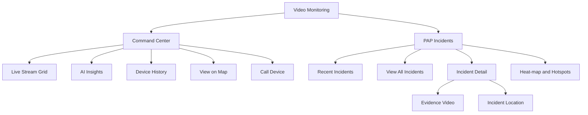

---

## 8. Core Concepts

### 8.1 Device Group

A monitored entity such as a vehicle, crane, asset or other configured group. A device group may have one or more camera channels.

### 8.2 Camera Channel

An individual stream source from a dashcam or video device. A device may support multiple channels such as road-facing, driver-facing, side or rear camera.

### 8.3 Stream Session

A live connection between Bolt and a selected camera channel. Stream state is temporary and may change independently from the vehicle's GPS or ignition status.

### 8.4 Incident

A system-generated safety or device event produced by the dashcam/AI pipeline. Examples include lane departure, driver distraction, forward collision warning, driver not in view, seat belt event and vehicle too close.

### 8.5 Evidence Clip

A video segment associated with an incident. Evidence clips must preserve the timestamp, device, channel, location and event metadata.

### 8.6 AI Insight

A real-time analytical signal shown inside Command Center. It may represent a live event, stream-specific risk, fleet distribution trend or incident hotspot.

AI Insights are derived from live dashcam events, stream health, vehicle/device status and incident metadata. They should help the operator understand where attention is required without changing the default stream-grid order.

### 8.7 Active Real-Time Incident

An active real-time incident is an incident currently being detected or reported by a live dashcam stream. While active, it must be visible on the corresponding stream card and highlighted with a red border around the stream box.

---

## 9. Command Center

Command Center is the main live monitoring workspace. It should give users a high-density overview of camera streams while still surfacing the most important risk signals through the AI Insights panel.

*Command Center showing the stream grid, stream states, controls, pagination and monitoring workspace.*

### 9.1 Layout

The page contains:

- Breadcrumb: `Video Monitoring > Command Center`.
- Primary stream action: `Stream All` or `Stop All Streams` depending on active state.
- Grid layout selector.
- Sort control.
- Filters control.
- Search input.
- Optional view switcher for grid/list view where supported.
- Fullscreen action.
- Stream grid.
- Right-side AI Insights panel.

The stream grid must remain the primary focus. AI insights should guide attention without taking over the monitoring layout.

### 9.2 Grid Layouts

The current module supports layout options such as `3x4`, `4x3`, `5x3` and `6x3`.

Implementation rule:

- Supported layouts should be configurable based on performance capacity and screen size.
- Layout naming should be consistent across product and design.
- The selected layout should persist for the user where possible.
- Fullscreen mode should preserve the selected layout and hide non-critical chrome.

### 9.3 Pagination and Chunk Loading

Streams are paginated and loaded in chunks. The Command Center should not attempt to load every accessible stream into the browser at once.

Rules:

- The stream grid should support a page view of up to 50 stream cards.
- All eligible streams on the current page view, up to 50, can be played simultaneously.
- Pagination should work together with search, filters, sorting and selected grid layout.
- Sorting and filters should be applied to the eligible dataset before pagination wherever backend support is available, so the user does not only sort the currently loaded chunk.
- `Stream All` applies to eligible streams on the current page view only.
- `Stop All Streams` stops streams on the current page view.
- When the user changes page, the system should release or stop stream sessions that are no longer visible unless a separate background-play behavior is explicitly introduced later.
- The UI should show pagination state clearly, such as current page, total entries and entries shown.

### 9.4 Stream Card

Each stream card should show:

- Device group or vehicle label.
- Channel label.
- Last updated timestamp.
- Live/offline/reconnecting state.
- Active incident label where applicable.
- Stream video or placeholder.
- Data rate where available.
- Channel actions.
- Selection/favourite state where supported.

When a real-time incident is happening on a stream, the stream card must enter an active incident state. The active incident state is shown through a red border around the stream box and an incident label on the card.

Rules:

- Apply the red border only to streams with an active real-time incident.
- Show the active incident name where space allows, such as Drowsiness, Distraction, Smoking, Harsh Braking, Forward Collision, Seatbelt or Driver Not in View.
- Keep the red border visible while the incident is active or until the incident expires based on system timeout.
- If multiple incidents are active on the same stream, show the highest-severity incident first.
- The red border is a visual alert state and should not automatically move the stream card unless the user changes the sort option to incident priority.
- Normal live streams should not use the red border, even if the device has older historical incidents.

### 9.5 Stream States

| State | UI Behavior |
|---|---|
| Not started | Shows placeholder and can be started manually or through Stream All. |
| Connecting | Shows loading indicator and connection progress. |
| Live | Shows current video feed and live status. |
| Network issue | Shows failure state with retry option and auto-retry messaging. |
| Reconnecting | Shows reconnecting status and should not duplicate stream sessions. |
| Offline | Shows unavailable state and prevents repeated unnecessary retry calls. |
| No match | Empty state when filters/search remove all streams from the view. |

The user must be able to differentiate a camera/device issue from a filter issue.

### 9.6 Bulk Stream Actions

`Stream All` should attempt to start all eligible streams on the current paginated page view. Because a page view supports up to 50 streams, Stream All may start up to 50 simultaneous streams when all streams on the page are eligible.

`Stop All Streams` should stop active streams in the current paginated page view and release resources.

Rules:

- Disabled or unsupported channels should be skipped and counted separately if required.
- Bulk actions should respect the current page, filters and stream eligibility.
- Bulk actions should not override filters silently.
- If some streams fail, show partial-success feedback.
- Stopping all streams should not clear the selected filters or layout.
- The system should prevent repeated rapid clicks from creating duplicate stream sessions.

### 9.7 Stream Recovery

*Stream recovery states showing failed connections, retry controls and auto-reload behavior.*

When streams fail, the system should show a clear error such as `Network issue`, `Connection to stream lost` or `Unable to connect`. Recovery behavior should include:

- Manual retry at stream-card level.
- Page-level retry where multiple streams fail.
- Auto-retry countdown where supported.
- Clear indication of how many streams failed.
- Stream health counts in the AI Insights/status area.

The UI should avoid making users guess whether the problem is device offline, network failure, browser failure or unavailable stream token.

---

## 10. Command Center Filters, Search and Sorting

Command Center must support fast narrowing of stream cards.

*Filter panel and applied filtering behavior for narrowing the live-stream grid.*

### 10.1 Filter Categories

The current interface includes the following filter categories:

- Device Group Status.
- Device Group Type.
- Device Group Category.
- Sub Organisation.
- View by Incident.
- Channel Streams.
- Channels.
- Favourites.

### 10.2 Search

Search should support device group name, vehicle number, owner/driver name and channel labels where available.

### 10.3 Applied Filter State

When filters are applied:

- Show applied chips.
- Allow individual chip removal.
- Provide `Clear filters & reload` when no streams match.
- Maintain selected layout and sort state.

### 10.4 Sorting

Sorting should support operationally useful fields such as:

- Last updated.
- Incident priority.
- Stream status.
- Device group name.
- Vehicle status.
- Favourites.

Default sorting rule:

- By default, devices/streams are sorted by `Last Updated`, with the most recently updated stream shown first.
- Sorting should be applied before pagination wherever technically possible. This ensures Page 1 contains the most recently updated streams from the full eligible result set, not just the newest streams within a pre-loaded chunk.
- The default sort should be deterministic. If two streams have the same last-updated value, use device group name or device ID as the secondary sort.
- Active real-time incidents should be highlighted with a red border, but they should not automatically override the default `Last Updated` sort.
- If the user selects `Incident Priority`, active incident streams should be shown first, ordered by severity and then by last updated.
- Sort choice should persist during the session and should not reset when filters are applied, removed or when the user moves between paginated pages.

---

## 11. Real-Time AI Insights Panel

The AI Insights panel provides context without requiring the user to leave Command Center.

### 11.1 Panel Content

The current interface shows:

- `Insights Engine` header.
- Live analytics cards.
- Active AI events such as forward collision, distraction, vehicle too close and seat belt event.
- Fleet distribution map.
- Device group status summary.
- Stream status summary.
- Selected stream context where applicable.

### 11.2 Live Event Cards

Each live event card should show:

- Event name.
- Severity/priority indicator.
- Live status.
- Time.
- Device or vehicle identifier.
- Optional click-through to incident details or filtered live stream.

### 11.3 AI Insight Population Logic

AI Insights should be populated from the following sources:

- Active dashcam incidents from live streams.
- Newly generated incident events from the PAP/event pipeline.
- Stream health changes such as offline, reconnecting, failed or recovered streams.
- Device group status, vehicle status and ignition/device connectivity where available.
- Location-based incident clusters and hotspots.
- Repeated incidents from the same device, driver, route, territory or organisation scope.

Priority order for insight cards:

1. Active critical incidents happening right now.
2. Active high/major incidents happening right now.
3. Multiple incidents on the same stream or device within the configured analysis window.
4. Location hotspots with repeated incidents.
5. Stream failures affecting monitoring continuity.
6. Device group or fleet distribution summaries.
7. Informational insights such as all-clear, low-risk distribution or no active event state.

Rules:

- Insights must respect the user's organisation, hierarchy and device-group permissions.
- Insights should refresh in near real time where live event data is available.
- Each insight should show a `last updated` or event timestamp so the user understands recency.
- Duplicate events from the same stream should be grouped within a configurable deduplication window.
- If the same stream has multiple active incidents, the highest-severity incident should drive the primary insight.
- Insights should not create a separate incident unless the underlying event pipeline has created or confirmed that incident.
- Clicking an insight should either focus the stream card, apply a contextual filter, open incident details or open the relevant map context.
- If no active insights are available, show an all-clear or empty insight state instead of stale incident cards.

### 11.4 Fleet Distribution

Fleet distribution should show the spatial spread of monitored vehicles/devices and use status/incident markers to indicate risk concentration.

### 11.5 Stream and Device Counts

Counts should include at minimum:

- Active.
- Idle.
- Stopped.
- Inactive.
- Live.
- Offline.
- Reconnecting.

Counts must reflect the current organisation scope and should indicate whether they are global or filtered.

### 11.6 Insight Interaction

Clicking an insight should either:

- Select the related stream in the grid.
- Filter the grid to matching incident streams.
- Open the incident detail page if evidence exists.
- Focus the related vehicle on the map.

The behavior must be predictable and should not unexpectedly stop active streams.

---

## 12. Stream Actions

### 12.1 Snapshot

Users can capture a snapshot from a camera channel.

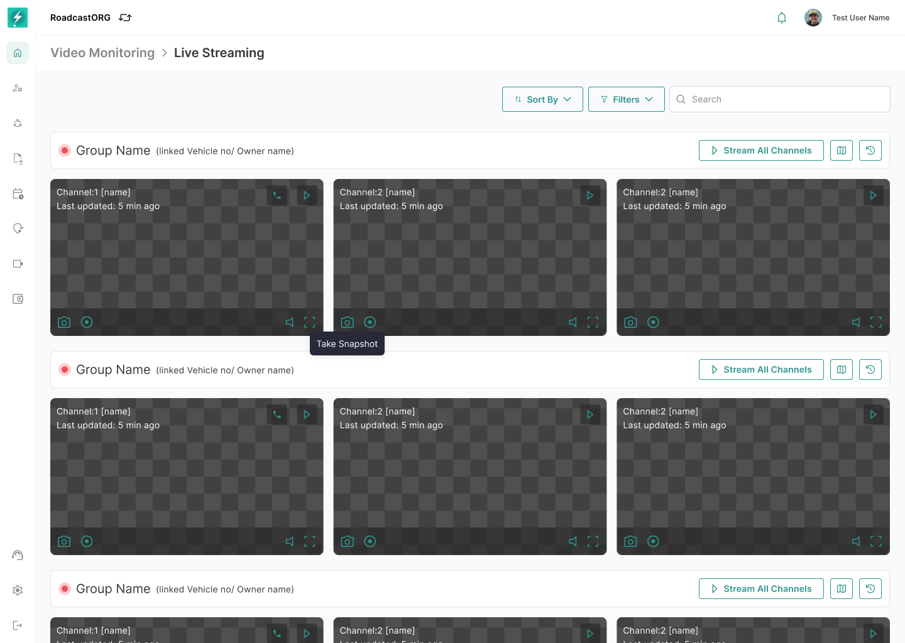

*Live stream workspace with the channel-level snapshot action and its related state.*

Rules:

- Snapshot action is available only when the channel is live or has a valid current frame.
- The system should show success feedback such as `Snapshot saved in Events`.
- Snapshot must store device group, channel, timestamp, user and organisation.
- Snapshot should be accessible later from the relevant evidence/event area where supported.

### 12.2 Recording

Users can start and stop recording where the device and permissions allow it.

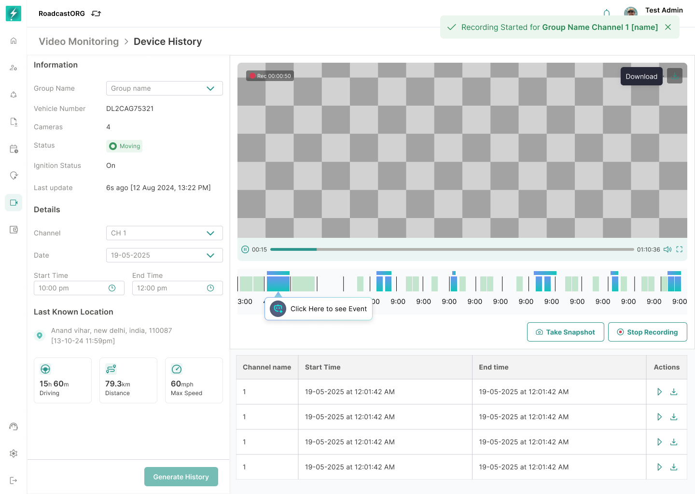

*Device History recording controls, active-recording state and saved-recording feedback.*

Rules:

- Start recording should show immediate feedback.
- Stop recording should show saved confirmation.
- Recording duration should respect system limits.
- Saved recording must preserve metadata and audit user action.
- If recording fails, show clear failure reason.

### 12.3 Call / Intercom

Users can initiate a voice connection with a supported device.

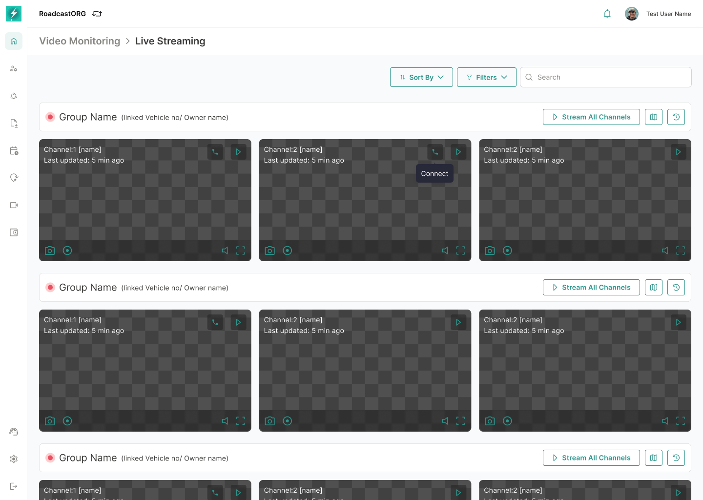

*Call-device workflow showing the stream context and intercom control states.*

Supported interface states include:

- Connect.
- Connecting.
- Speak Now.
- Mic on/off.
- Speaker on/off.
- Disconnect.
- Connection error.

Rules:

- Call action is available only for devices that support intercom.
- Only authorised users can initiate calls.
- The UI should prevent more than one active call to the same device from the same user session.
- Connection failure must be recoverable without refreshing the page.
- Disconnect should terminate the session cleanly.

### 12.4 View on Map

Users can move from a live stream to map context.

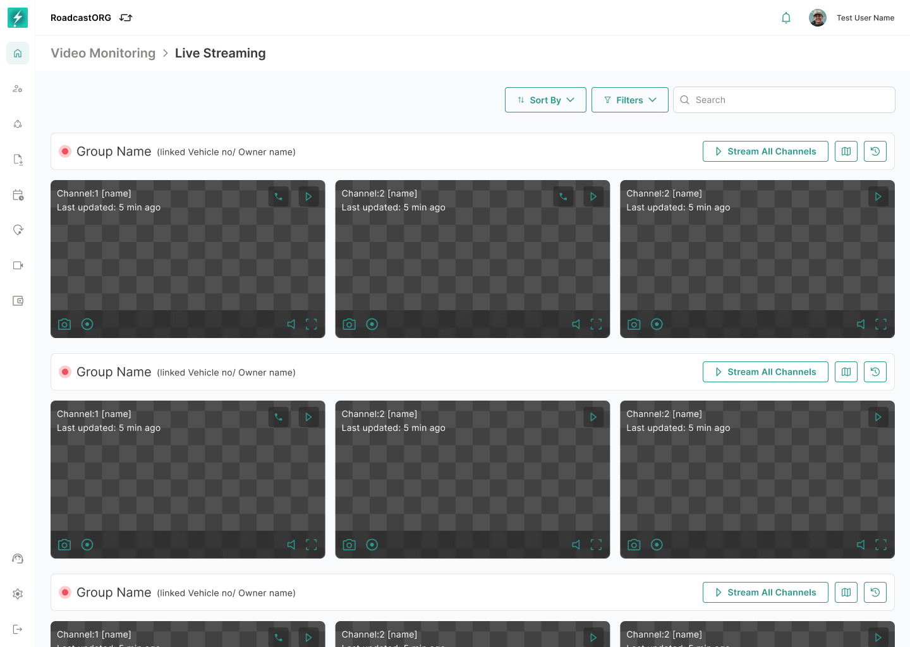

*Map context for a selected video-enabled vehicle, with its streaming panel preserved.*

Rules:

- The map should focus the selected device group/vehicle.
- Vehicle status and location should remain visible.
- The Video Streaming tab should show available channels.
- Returning to Command Center should preserve prior stream layout where technically feasible.

---

## 13. Device History

Device History allows users to generate and review historical video for a selected device/channel/time range. It is used for both historical stream playback and incident/event review on that historical timeline.

The workflow should help users answer: what happened on this device, on this camera channel, during this time window, and whether any incidents were detected during that period.

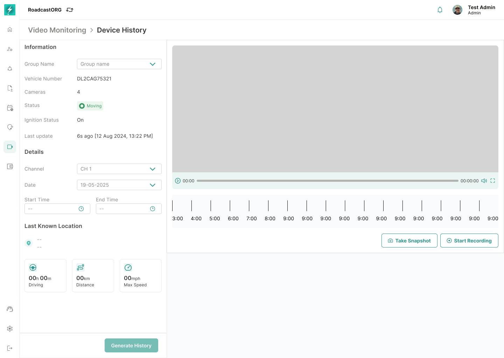

*Device History before generation, including vehicle context, channel selection, date and time inputs.*

### 13.1 Entry Points

Device History can be opened from:

- A live stream card.
- A device group action.
- Map vehicle panel where video streaming is available.
- Incident-related workflows where historical review is needed.

### 13.2 Required Inputs

- Channel.
- Date.
- Start time.
- End time.

The UI must show validation when the user tries to generate history without selecting the required time window.

### 13.3 Device Context

The page should show:

- Device group name.
- Vehicle number.
- Number of cameras.
- Vehicle/device status.
- Ignition status.
- Last update time.
- Last known location.

### 13.4 Generate History

After the required inputs are supplied, the system should fetch the historical footage and render the player.

*Generated history with playback, timeline availability, event markers and channel-level output.*

States:

- Empty state before time selection.
- Validation error.
- Loading/fetching state.
- Generated playback.
- No event/video found.
- Failed to fetch history.

### 13.5 Historical Stream and Incident Review

The generated history view should support:

- Historical stream playback for the selected channel and time range.
- Incident/event markers on the video timeline where incident metadata exists.
- Ability to jump from an incident marker to the relevant timestamp in the historical stream.
- Clear differentiation between generated video footage and generated incident highlights.
- Empty state when historical footage is available but no incidents are found.
- Empty state when neither footage nor incidents are available for the selected time range.
- Download of generated historical footage where user permission and device capability allow it.

Incident markers should use the incident timestamp from the event pipeline. If the incident timestamp and video timestamp differ, the system should retain both values internally and use the video timestamp for playback seeking.

### 13.6 BIRA / Event Highlights

The interface includes `Get Event Highlights with BIRA` and `Run BIRA Analysis`.

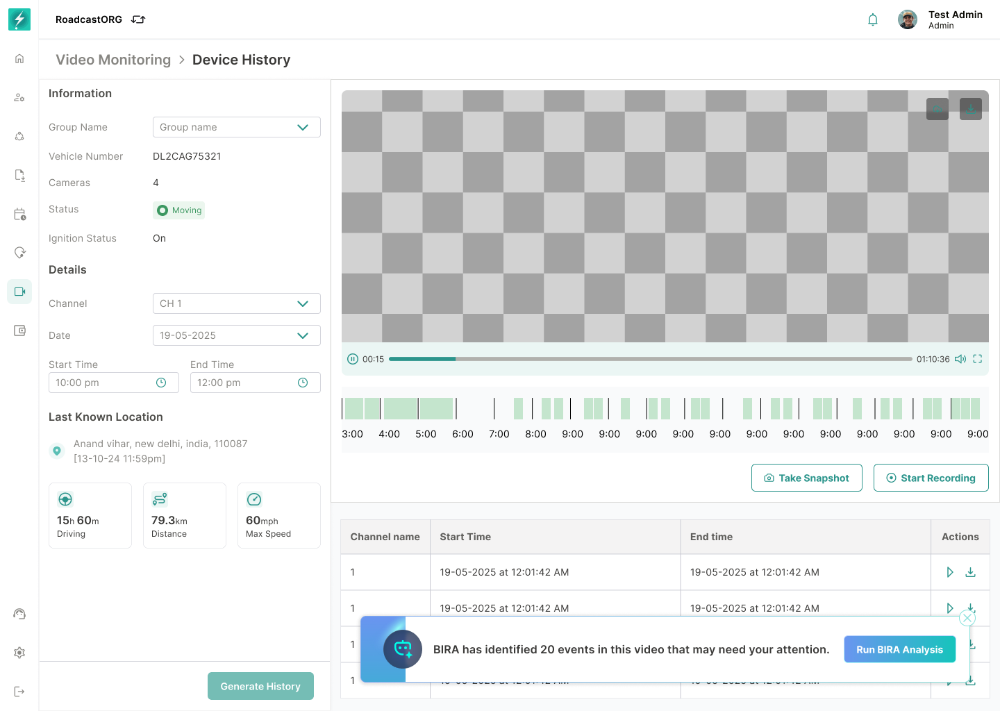

*BIRA analysis entry inside Device History, with stream playback, timeline data and analysis actions.*

For the initial PRD, BIRA should be treated as an optional event-highlight analysis layer over generated history. It should not block the core Device History flow.

Rules:

- BIRA action appears only when historical video is generated.
- Analysis should show meaningful highlights if events are detected.
- If no events are found, show a clear empty state.
- Highlight timestamps should seek the player to the relevant segment.

### 13.7 Download History

Where permitted, users can download generated history output.

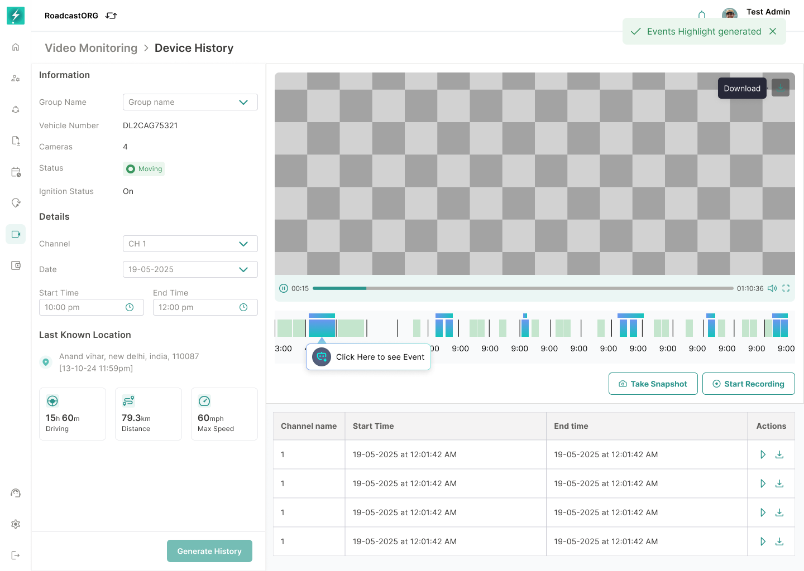

*Generated Device History with per-segment playback and download actions.*

Rules:

- Downloads require permission.
- Downloaded file should include the correct device, channel and time range metadata.
- Download failure should not discard the generated history session.

---

## 14. PAP Incidents

PAP Incidents is the evidence and incident-intelligence page. PAP stands for Predict, Act and Prevent as reflected in the product copy.

*PAP Incidents dashboard with recent incidents, severity summaries, heat-map and current hotspots.*

### 14.1 Landing Page

The page should show:

- Breadcrumb: `Video Monitoring > PAP Incidents`.
- Title and helper copy.
- Recent incident cards.
- `View All Incidents` action.
- Severity summary metrics.
- Incident heat-map.
- Current hotspots.

### 14.2 Empty State

When no incidents exist:

*Empty PAP Incidents state with no recorded incidents and no current hotspots.*

- Show `No Incidents Recorded` or equivalent copy.
- Do not show misleading severity counts.
- Hotspot area should show `No Current Hotspots`.
- The page should still allow navigation back to Command Center.

### 14.3 Severity Metrics

The current interface shows high, medium and low severity counts. The wider platform may also use critical, major and minor labels.

Implementation rule:

- Use one severity taxonomy consistently across Video Monitoring.
- Recommended taxonomy: `Critical`, `High`, `Medium`, `Low` if the wider Bolt alert system supports four levels.
- If the current backend only supports three levels, use `High`, `Medium`, `Low` and map legacy critical/major/minor labels during migration.

### 14.4 Incident Card

Each card should show:

- Thumbnail/video preview.
- Play affordance.
- Severity badge.
- Incident name.
- Device/group identifier.
- Timestamp.
- Location.
- Download action where permitted.

Cards should open Incident Details when clicked.

---

## 15. View All Incidents

`View All Incidents` opens the complete incident dataset beyond recent cards.

*Complete incident list with severity summaries, incident cards, actions and pagination.*

### 15.1 Incident List

The incident list should support:

- Incident name.
- Status.
- Camera channel.
- Device model.
- Event/incident type.
- Time.
- Linked group.
- Last updated.
- Actions.

### 15.2 Filters

*Filter panel for narrowing incidents by time, severity, organisation, group and event attributes.*

The current interface includes filter categories such as:

- Event time.
- Severity.
- Sub-org.
- Device group.
- Events.
- Device group category.

The user should be able to search inside filter values and apply multiple filters.

### 15.3 Applied Filters

Applied filters should be visible as chips. Users must be able to remove individual filters or clear all.

*Applied filters visible above the filtered incident result set.*

### 15.4 Search

Search should support event name, vehicle/device identifier and location where available.

---

## 16. Incident Details

Incident Details is the investigation page for one incident.

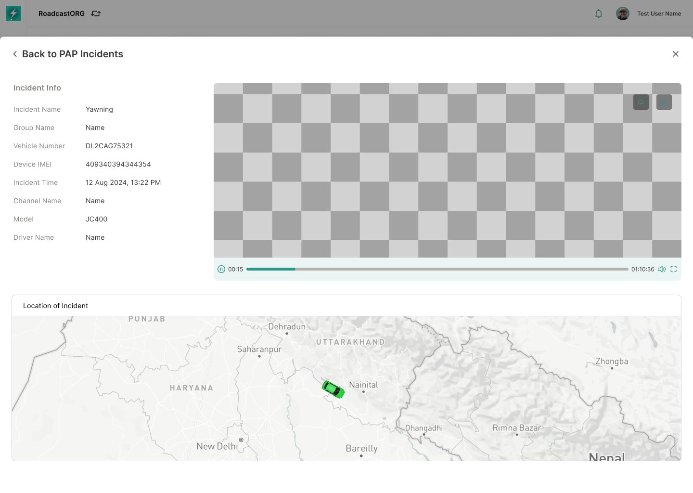

*Incident investigation page with evidence playback, incident metadata and map location.*

### 16.1 Page Content

The page should show:

- Back link to PAP Incidents or originating context.
- Evidence video player.
- Incident metadata.
- Incident location section.

### 16.2 Incident Metadata

The incident information should include:

- Incident name.
- Device ID / IMEI.
- Group name.
- Vehicle number.
- Severity.
- Incident time.
- Event name.
- Channel name.
- Device model.
- Driver name, if available.
- User name, if available.
- Location coordinates and address where available.

### 16.3 Video Player Actions

The current interface shows video controls and menu actions including:

- Download.
- Playback speed.
- Picture-in-picture.
- Fullscreen.

Rules:

- Video should load from the evidence clip associated with the incident.
- Download action requires permission.
- If the clip is unavailable, show a clear unavailable state and keep the metadata visible.
- Player actions should not change the incident verification status unless a separate verification workflow is introduced.

### 16.4 Incident Location

The `Location of Incident` area should show a map or location context for the incident.

Rules:

- If coordinates are available, show map focus.
- If only address is available, show address text.
- If no location exists, show `Location unavailable` rather than leaving the section blank.

---

## 17. Heat-map and Hotspots

The heat-map helps safety teams identify repeated incident locations.

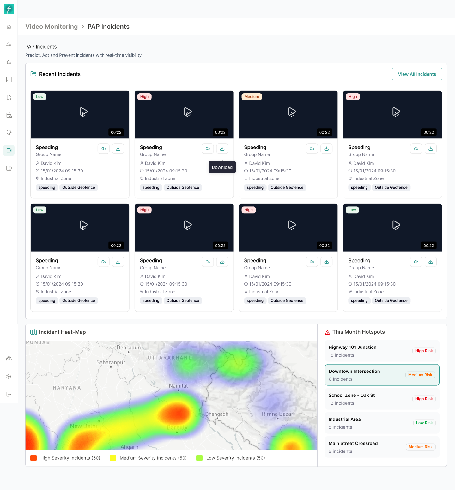

*Incident density heat-map, severity legend and hotspot risk list.*

### 17.1 Heat-map

The heat-map should visualise incident density by severity.

Rules:

- The severity legend must match the severity taxonomy used in the rest of PAP Incidents.
- Filters applied to incidents should update the heat-map.
- Hover or click should reveal hotspot-level summary where supported.

### 17.2 Current Hotspots

Hotspot cards should show:

- Location name.
- Incident count.
- Risk label.
- Optional drill-down to filtered incident list.

### 17.3 Hotspot Drill-down

Clicking a hotspot should filter the incident list to that area or open a hotspot detail if one is designed later.

---

## 18. Event Reference Guide

The Event Reference Guide should help users understand what each system-generated event means.

*Event reference panel grouping driving, driver-monitoring, device and ADAS event definitions.*

The reference guide groups events into:

- Driving Behavior Events.
- Driver Monitoring System events.
- System & Device Events.
- ADAS events.

Each event definition should include:

- Event name.
- Description.
- Severity mapping.
- Supported camera/device models.
- Whether video evidence is expected.
- Whether it appears in Command Center insights, PAP Incidents or both.

This guide should be accessible from PAP Incidents and potentially from the event filter or incident detail page.

---

## 19. Incident-Centric Live Stream View

The UI references `View Incident-Centric Live Stream`. This should provide a focused monitoring mode for streams with active or recent incidents.

Rules:

- The view should include only streams that have active incidents or recent incident relevance.
- Users should be able to return to the normal Command Center grid.
- The filter state should be visible so users know why only certain streams are shown.
- AI insight cards should remain visible or accessible.

---

## 20. Data Model

### 20.1 Main Entities

| Entity | Purpose |
|---|---|
| Device Group | Vehicle/asset/person grouping visible to the user. |
| Video Device | Dashcam or video hardware associated with a device group. |
| Camera Channel | Individual video stream channel on a device. |
| Stream Session | Active or attempted live-stream connection. |
| Incident | AI/system-generated safety or device event. |
| Evidence Clip | Video segment associated with an incident or recording. |
| Snapshot | Still image captured from a stream. |
| Device History Request | Historical video fetch request for channel/time range. |
| AI Insight | Real-time insight shown in Command Center. |
| Hotspot | Aggregated location with repeated incidents. |
| User Action Audit | Record of sensitive video actions. |

### 20.2 Stream Session Fields

Minimum fields:

- Stream session ID.
- Device ID.
- Device group ID.
- Channel ID.
- User ID.
- Organisation ID.
- Status.
- Started at.
- Stopped at.
- Last heartbeat.
- Error code/message.
- Data rate.

### 20.3 Incident Fields

Minimum fields:

- Incident ID.
- Event type.
- Incident name.
- Severity.
- Device ID.
- Device group ID.
- Channel ID.
- Vehicle number.
- Driver ID/name where available.
- Timestamp.
- Location coordinates.
- Address.
- Evidence clip ID.
- Thumbnail URL.
- Status.
- Created at.
- Last updated.

---

## 21. System Rules

### 21.1 Stream Eligibility

A camera channel can be streamed only when:

- The user has video permission.
- The device is assigned to the user's accessible organisation/device group.
- The device supports live streaming.
- A valid stream token/session can be created.
- Device/network status allows a stream attempt.

### 21.2 Channel Capability

Not all devices support every action. The system should check capability before showing or enabling:

- Live stream.
- Intercom/call.
- Snapshot.
- Recording.
- Device History.
- Multi-channel playback.
- AI incident generation.

Unsupported actions should be hidden or disabled with a clear reason.

### 21.3 Stream Lifecycle

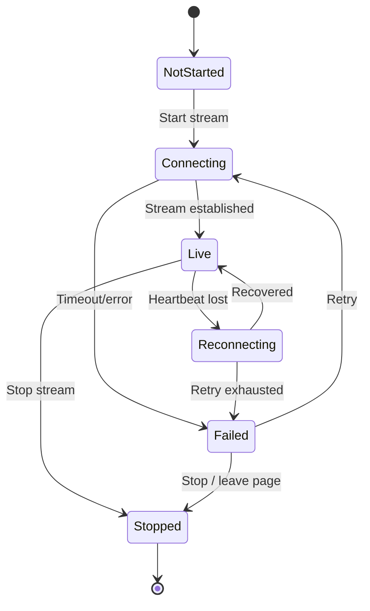

### 21.4 Evidence Integrity

Incident evidence must preserve:

- Original timestamp.
- Device/channel source.
- Location context.
- Incident type and severity.
- Clip generation status.
- User access and download audit.

Evidence metadata should not be overwritten by later edits to vehicle name, driver assignment or group name. Display names may update, but raw identifiers and original event metadata must remain traceable.

---

## 22. Empty, Error and Edge States

| Scenario | Expected behavior |
|---|---|
| No streams available | Show empty state with explanation and no broken grid. |
| Filters return no streams | Show `No videos match your filters` with clear filters action. |
| Stream connection fails | Show card-level error and retry. |
| Many streams fail | Show page-level warning and Retry action. |
| Stream reconnects | Keep card position and update status. |
| Device offline | Show offline state and avoid endless retries. |
| User lacks permission | Hide restricted video content and show permission message if user navigates directly. |
| Evidence clip unavailable | Keep metadata visible and show clip unavailable state. |
| No incidents | Show PAP empty state and zero metrics. |
| Invalid history input | Ask user to select required time values. |
| No historical video found | Show no data state without clearing selected inputs. |
| Download fails | Show failure and allow retry. |
| Call fails | Show connection error and allow reconnect/disconnect. |

---

## 23. Performance and Reliability

### 23.1 Stream Load Management

- Streams should be paginated and loaded in chunks.
- A page view can contain up to 50 stream cards.
- All eligible streams on the current page view, up to 50, can be played simultaneously.
- Bulk start should be orchestrated to avoid network spikes, but the end state should allow all eligible streams on the page to play together.
- Streams outside the current paginated page should not continue consuming live-stream resources unless explicitly supported later.
- Streams outside the visible viewport may be optimised or deprioritised only if it does not break the requirement that all streams on the current page can be played simultaneously.
- Failed streams should not retry indefinitely.

### 23.2 Command Center Performance Targets

| Metric | Target |
|---|---|
| Initial page shell load | Under 3 seconds on standard broadband. |
| Stream card state update | Under 2 seconds after backend state change. |
| Filter application | Under 1 second for current loaded dataset. |
| Incident insight update | Near real time, target under 10 seconds after event ingestion. |
| Stream recovery feedback | Visible within 5 seconds of stream failure detection. |

### 23.3 Incident Page Performance

- Incident cards should lazy-load thumbnails.
- Incident video should load only when opened or played.
- Heat-map should aggregate server-side for large datasets.
- View All Incidents should use pagination or virtual scrolling.

---

## 24. Security, Privacy and Compliance

Video Monitoring handles sensitive driver, passenger and location data.

Rules:

- Access must be organisation and RBAC controlled.
- Evidence URLs must be protected and should expire where applicable.
- Downloads must be logged.
- Intercom/call actions must be logged.
- Production data should not expose unrelated organisations or devices.
- Privacy masking or stream hiding should be supported in future where required by customer policy.
- Incident clips should follow configured retention/storage rules.

Recommended audit events:

- Stream started.
- Stream stopped.
- Snapshot captured.
- Recording started.
- Recording stopped/saved.
- Evidence downloaded.
- Incident detail viewed.
- Device history generated.
- Intercom call connected/disconnected.

---

## 25. Analytics Events

Recommended product analytics:

| Event | Trigger |
|---|---|
| video_command_center_opened | User opens Command Center. |
| video_stream_all_clicked | User starts all eligible streams on the current paginated page view. |
| video_stop_all_clicked | User stops active streams on the current paginated page view. |
| video_stream_retry_clicked | User retries failed stream. |
| video_filter_applied | User applies stream or incident filter. |
| video_snapshot_taken | Snapshot success. |
| video_recording_started | Recording starts. |
| video_recording_saved | Recording saved. |
| video_intercom_started | Call initiated. |
| video_device_history_generated | Historical video generated. |
| video_pap_opened | User opens PAP Incidents. |
| video_incident_detail_opened | User opens incident detail. |
| video_incident_downloaded | User downloads evidence. |
| video_hotspot_clicked | User clicks a hotspot. |

---

## 26. Acceptance Criteria

### 26.1 Command Center

- Users can open Command Center and see accessible stream cards.
- Streams are loaded through pagination/chunking rather than loading all accessible streams at once.
- A page view can show up to 50 stream cards.
- Users can play all eligible streams on the current page view simultaneously, up to 50 streams.
- Users can switch supported grid layouts.
- Users can start and stop all eligible streams on the current paginated page view.
- Stream cards show clear live, connecting, offline, failed and reconnecting states.
- Users can retry failed streams.
- Users can search, sort and filter streams.
- Default stream sorting is based on `Last Updated`, with the most recently updated stream shown first.
- Streams with an active real-time incident are highlighted with a red border around the stream box.
- Empty filter state clearly explains that no videos match current filters.
- AI Insights panel shows live event feed, fleet distribution and stream/device status summaries.
- AI Insights are populated using active incidents, stream health, device status, hotspot and repeated-event signals.
- Clicking relevant insights focuses or filters the related stream/incident context.
- Fullscreen mode preserves the current stream layout.

### 26.2 Stream Actions

- Users can capture snapshots where channel and permissions allow it.
- Snapshot success state is displayed.
- Users can start/stop recording where supported.
- Users can initiate and disconnect intercom calls where supported.
- Unsupported actions are hidden or disabled.
- Sensitive actions are auditable.

### 26.3 Device History

- Users can open Device History from an eligible stream/device.
- Required inputs are visible and validated.
- Historical video can be generated for a valid channel/time range.
- Users can review historical stream playback and incident/event markers for the selected time range.
- Users can jump from an incident/event marker to the relevant timestamp in the historical stream.
- Empty, no-data and failure states are handled clearly.
- Users can download generated history where permitted.
- BIRA/event highlights do not block the base history flow.

### 26.4 PAP Incidents

- Users can open PAP Incidents and view recent incidents.
- Incident cards show thumbnail, severity, name, time, device/group and location.
- Users can open incident details.
- Users can view all incidents and apply filters.
- Applied filters are visible and removable.
- Incident details show evidence video, metadata and location.
- Evidence download works only for permitted users.
- Heat-map and hotspots reflect incident data and active filters.
- Empty state appears correctly when no incidents exist.

### 26.5 Permissions and Security

- Users see only authorised device groups, channels and incidents.
- Restricted evidence cannot be accessed through direct URLs.
- Downloads and intercom actions are logged.
- Stream sessions are stopped when permissions are revoked or user session ends.

---

## 27. Open Decisions

| Topic | Decision Needed |
|---|---|
| Severity taxonomy | Confirm whether Video Monitoring should use `High/Medium/Low` or Bolt-wide `Critical/High/Medium/Low`. |
| Evidence retention | Confirm default retention period for incident clips, snapshots and recordings. |
| AI insight refresh and deduplication window | Confirm refresh frequency and the time window for grouping repeated events from the same stream/device. |
| Active incident expiry | Confirm when the red stream-card border should clear if the incident feed does not send an explicit resolved state. |
| BIRA scope | Confirm whether BIRA is part of initial release or a later enhancement. |
| Privacy controls | Confirm whether driver/passenger blur or stream hiding is required for initial release. |
| Mobile scope | Confirm whether Video Monitoring mobile consumption is required in this PRD. |

False incident handling, incident verification and escalation actions are not open decisions for this PRD. They are explicitly out of scope and should be defined in a separate sprint.

---

## 28. Implementation Notes

- Treat Command Center and PAP Incidents as separate pages with shared device, channel and incident services.
- Keep live stream sessions separate from evidence clip playback.
- Use device capability checks before rendering stream actions.
- Preserve user layout/filter preferences where useful, but avoid persisting temporary incident filters permanently.
- Maintain stream card position during reconnect attempts to avoid disorienting operators.
- Build incident cards and incident detail from the same source metadata to avoid mismatched evidence.
- Use server-side aggregation for heat-map and hotspot views at scale.
- Add clear telemetry for stream failures so support teams can identify device, network and backend issues.

---

## 29. Suggested Release Phasing

### Phase 1 — Core Monitoring and Incidents

- Command Center stream grid.
- Stream states and retry.
- Search, sort and filters.
- AI Insights panel basic feed and counts.
- PAP Incidents landing and incident detail.
- Evidence playback and download.

### Phase 2 — Operational Controls

- Intercom/call workflow.
- Snapshot and recording flows.
- Device History generation and download.
- View on Map integration.
- Incident heat-map and hotspots.

### Phase 3 — Intelligence and Compliance

- BIRA event highlights.
- Incident-centric live streams.
- Device capability matrix.
- Privacy controls.
- Advanced AI Safety Copilot and risk scoring.

Future sprint outside this PRD:

- False incident handling and incident verification.
- Manual incident correction or false-positive workflows.
- Escalation actions that depend on reviewed/verified incident status.

---

## 30. PRD Summary

Video Monitoring should function as a real-time command and evidence module for Bolt. Command Center / Control Tower gives operators the live operational view across streams, stream health, AI insights and vehicle context. PAP Incidents gives safety teams the structured evidence layer for AI-detected incidents, severity analysis, heat-map review and incident investigation.

The immediate product priority is to stabilise the core monitoring loop: stream visibility, stream state clarity, incident discovery, evidence playback and permission-safe actions. Advanced intelligence such as BIRA, incident verification, privacy controls and AI copilots can build on the same foundation after the base workflow is reliable.
