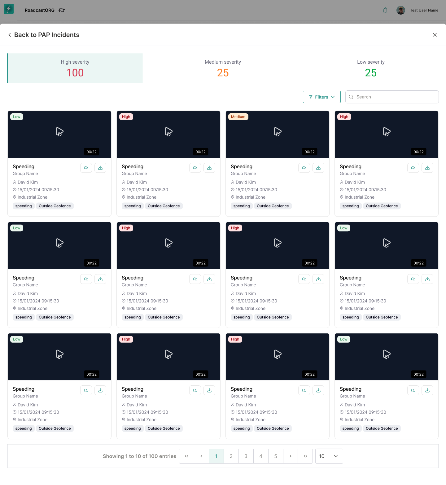
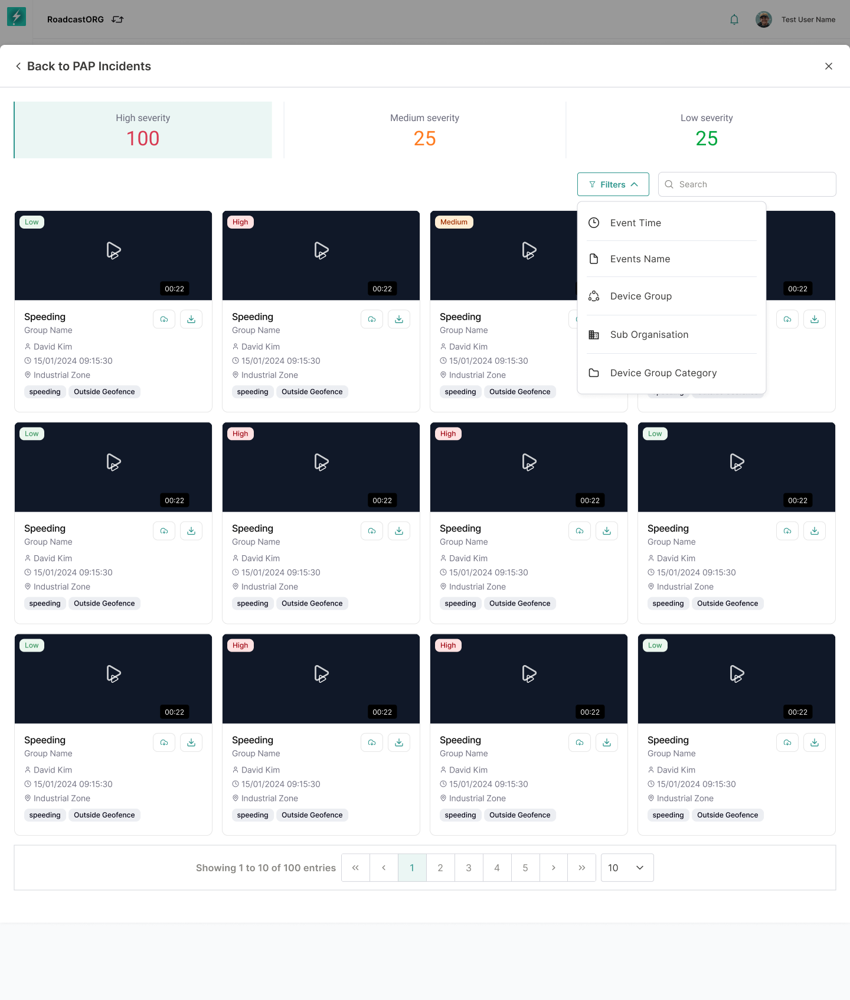
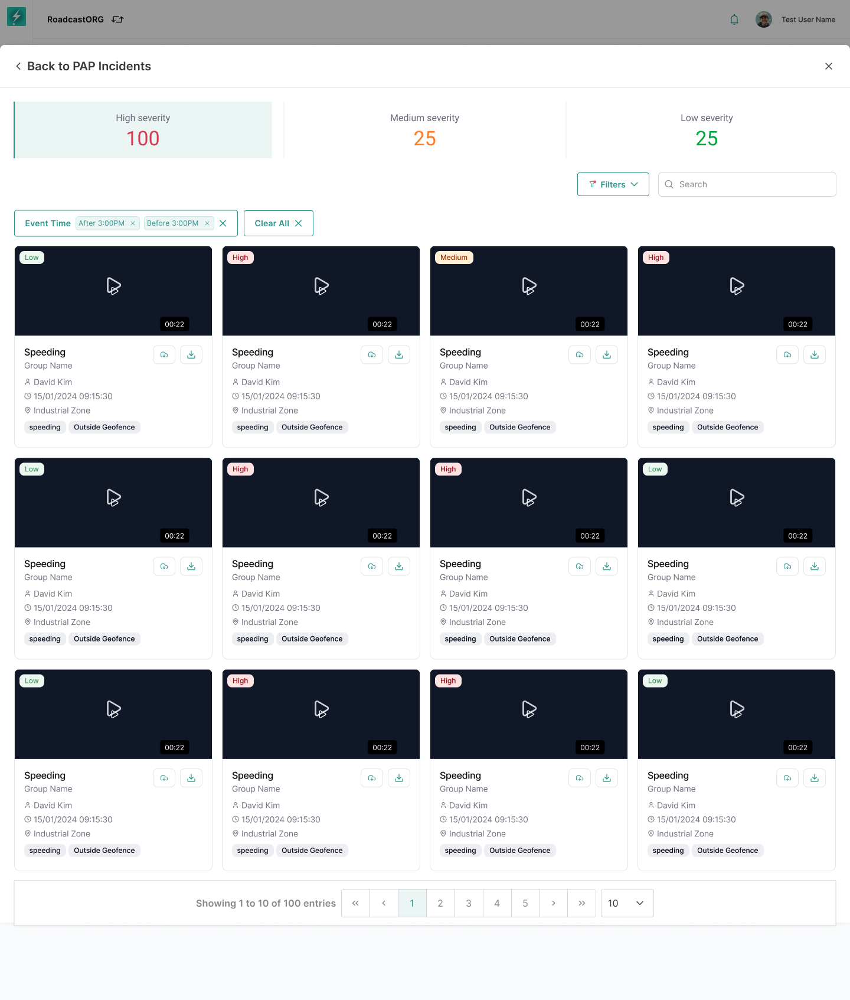

## 15. View All Incidents

`View All Incidents` opens the complete incident dataset beyond recent cards.

*Complete incident list with severity summaries, incident cards, actions and pagination.*

### 15.1 Incident List

The incident list should support:

- Incident name.
- Status.
- Camera channel.
- Device model.
- Event/incident type.
- Time.
- Linked group.
- Last updated.
- Actions.

### 15.2 Filters

*Filter panel for narrowing incidents by time, severity, organisation, group and event attributes.*

The current interface includes filter categories such as:

- Event time.
- Severity.
- Sub-org.
- Device group.
- Events.
- Device group category.

The user should be able to search inside filter values and apply multiple filters.

### 15.3 Applied Filters

Applied filters should be visible as chips. Users must be able to remove individual filters or clear all.

*Applied filters visible above the filtered incident result set.*

### 15.4 Search

Search should support event name, vehicle/device identifier and location where available.

---
