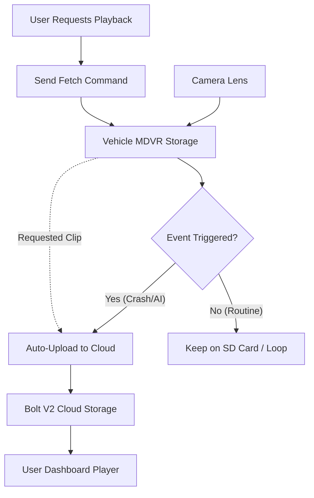

# Video Monitoring System

The Video Monitoring module integrates Mobile DVR (MDVR) hardware with the Bolt V2 dashboard. It allows fleet managers to verify road events, monitor driver behavior (DMS), and provide visual proof for insurance claims.

#### 1. Live Streaming Interface

Live streaming allows you to "ride along" with the driver in real-time.

**1.1 Accessing the Live Feed**

1. **Select Vehicle:** From the Live Map sidebar, click on a vehicle equipped with cameras (look for the "Video" or "Camera" icon badge).
2. **Open Video Panel:** Click the **"Live Video"** tab in the side panel.
3. **Select Channel:** Choose which camera to view (e.g., _Channel 1: Road Facing_, _Channel 2: Driver Facing_).

<figure><figcaption></figcaption></figure>

**1.2 Multi-Camera Grid**

For viewing multiple angles simultaneously:

* **Grid View:** Toggle the "4-Up" view to see the Road, Cabin, Rear, and Cargo views at the same time.
* **Bandwidth Note:** Streaming 4 channels simultaneously consumes approximately **2 MB/minute** of data per vehicle.

#### 2. Historical Playback & Evidence

Retrieving past footage requires a specific "Request" workflow because video files are stored locally on the MDVR's hard drive/SD card to save data costs.

**2.1 Requesting Footage**

1. Navigate to **Analytics > Video History**.
2. **Select Timeframe:** Choose the Date and exact Time (e.g., `14:00` to `14:05`).
3. **Fetch:** Click "Request Clip."
4. **System Logic:** The server wakes up the device, locates the specific file segment, and uploads it to the cloud. Once uploaded, the status changes from **"Pending"** to **"Available."**

#### 3. ADAS & DMS Event Logic

The video system is tightly coupled with **Advanced Driver Assistance Systems (ADAS)** and **Driver Monitoring Systems (DMS)**.

**3.1 Automated Event Capture**

Instead of watching 24/7, the system automatically clips video when specific triggers occur.

| Event Type        | Trigger Logic                | Video Action                              |
| ----------------- | ---------------------------- | ----------------------------------------- |
| **Harsh Braking** | G-Sensor > 0.5g Deceleration | Uploads 10s clip (5s before + 5s after).  |
| **Drowsy Driver** | DMS AI detects closed eyes   | Uploads "Cabin View" snapshot & video.    |
| **Distraction**   | DMS AI detects phone usage   | Uploads "Cabin View" clip to Audit Trail. |

**3.2 Notification Integration**

When a video event is triggered:

1. An alert appears in the **Notification Manager**.
2. Clicking the alert opens the **Event Replay** modal immediately, showing the footage of the incident.

#### 4. Data Flow & Storage Logic

Understanding where video lives is critical for managing data costs.

* **Local Storage:** High-definition (1080p) footage is stored on the vehicle. It loops (overwrites) every 1-2 weeks depending on disk size.
* **Cloud Storage:** Only "Events" and "Requested Clips" are permanently saved in the Bolt V2 cloud for audit purposes.

#### 5. Troubleshooting Video Issues

| Issue                | Likely Cause | Resolution                                                                                                |
| -------------------- | ------------ | --------------------------------------------------------------------------------------------------------- |
| **"Device Offline"** | Ignition OFF | Most MDVRs shut down 20 mins after ignition OFF to save battery. Ask the driver to start the vehicle.     |
| **"Channel Loss"**   | Loose Cable  | If CH1 works but CH2 is black, check the physical aviation connector on the MDVR box.                     |
| **Lag/Choppy Video** | Poor Signal  | The vehicle is in a 2G zone. Video requires strong 4G/LTE. Wait for the vehicle to move to a better area. |

