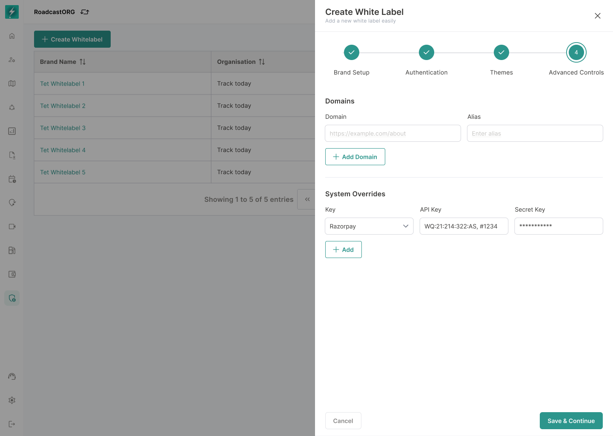
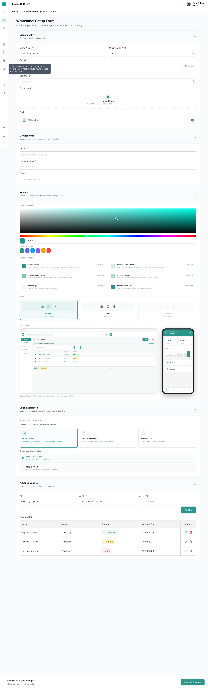

## 15. Advanced Controls and Domain Management

Advanced Controls include domain setup and other high-risk configuration.

*Advanced Controls capture domains and system-owner credentials that require stricter permissions and secure handling.*

### 15.1 Domains

Approved interface:

- Domains section.
- Add Domain action.
- Domain table with Domain and Created On.

### 15.2 Domain Requirements

- User can add one or more domains based on entitlement.
- Domain must be unique across all Bolt tenants.
- Domain must pass verification before activation.
- System should support CNAME/TXT guidance.
- SSL must be provisioned before domain can become Active.
- Invalid or unverified domains must not be used for production traffic.

### 15.3 Domain Statuses

Recommended statuses:

| Status | Meaning |
| --- | --- |
| Not Configured | No domain entered. |
| DNS Pending | Domain entered, awaiting DNS setup. |
| DNS Verified | DNS record verified. |
| SSL Provisioning | Certificate being issued. |
| Active | Domain is live and mapped to the whitelabel. |
| Failed | Verification or SSL failed. |

### 15.4 Existing Redirect Model

Operational requirements indicate current white-label domain support often redirects to Bolt through CNAME or domain mapping. The new product should keep this behaviour where required, but surface it as a guided configuration with clear status, rather than hidden internal setup.

---

### 15.5 Guided CNAME Configuration

Domain setup must explain the required host record, destination value, verification state, and activation dependency in plain language. Credentials or provider keys shown in the broader form must be masked and permission-restricted.

*The extended management form includes CNAME guidance alongside brand, theme, app-distribution, and system configuration.*

---
