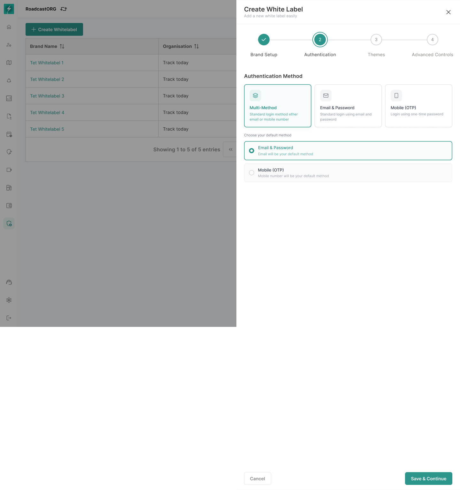
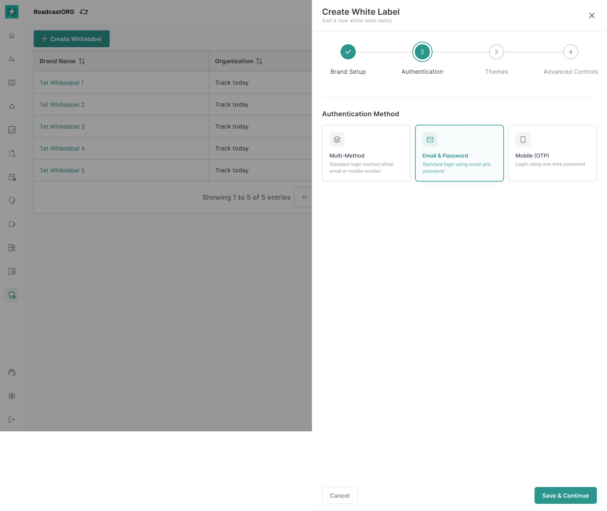
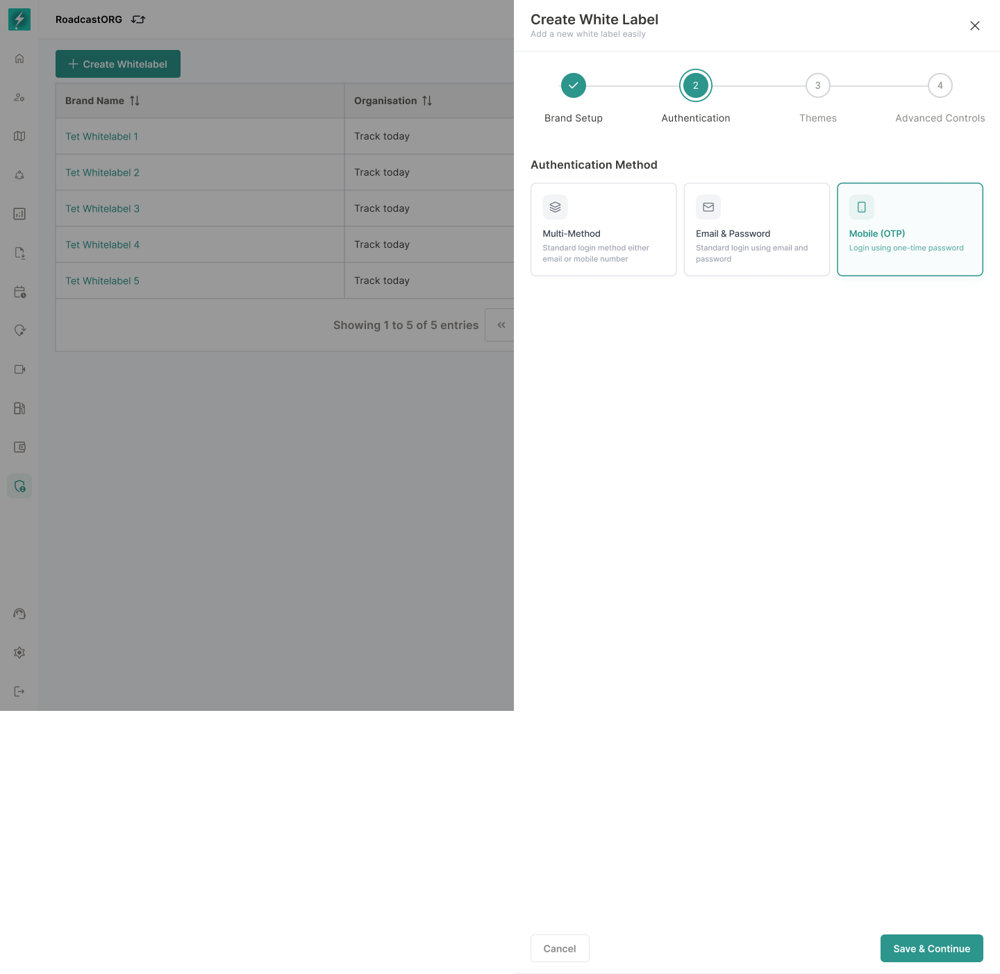

## 13. Authentication / Login & Experience

Authentication configuration controls how users access the branded experience.

### 13.1 Approved Authentication States

The approved interface supports:

- Authentication Method.
- Multi-method default state.
- Email & Password method.
- Mobile OTP-only state.
- Default method messaging, for example email as default.

*Multiple enabled methods require one clearly selected default.*

*Email and password can operate as the only enabled method where organisation policy allows it.*

*Mobile OTP can operate as the only enabled method when OTP infrastructure and organisation policy support it.*

### 13.2 Requirements

- User can select one or more login methods where supported.
- User can choose the default method when multiple methods are enabled.
- Default method must be shown clearly in read-only and edit states.
- Authentication configuration must not override security rules enforced by the platform.
- If mobile OTP is enabled, SMS/OTP provider readiness must be validated separately.
- If email login is enabled, email service configuration must exist at platform level.

### 13.3 Login Experience

Full login-page layout customisation remains future scope unless already supported by engineering. Initial release should support:

- Branded logo.
- Brand name.
- Primary colour application.
- Legal links.
- Authentication method selection.

---
