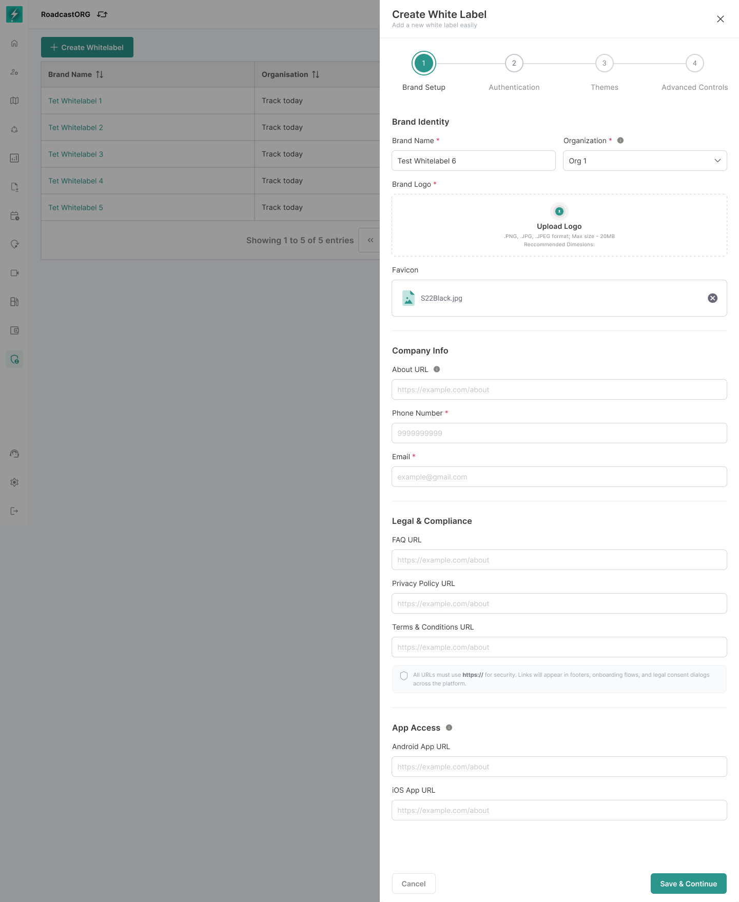

## 12. Brand Setup

Brand Setup defines the public identity of the whitelabel.

*Brand Setup collects brand identity, contact information, legal links, and app-access links in the first wizard step.*

### 12.1 Brand Identity

Approved fields:

| Field | Requirement | Validation |
| --- | --- | --- |
| Brand Name | Required | Text, unique in organisation scope. |
| Organisation | Required | Must be an existing organisation the user can manage. |
| Brand Logo | Required in the approved interface | PNG, JPG or JPEG; max 20 MB shown in the approved interface. |
| Favicon | Optional/Recommended | PNG, ICO or SVG decision pending; 512 × 512 px recommendation appears in approved interface copy. |

### 12.2 Company Info

Approved fields:

| Field | Requirement | Validation |
| --- | --- | --- |
| About URL | Optional/Recommended | Must use `https://`. |
| Phone Number | Required in create flow | Country/format validation. |
| Email | Required in create flow | Valid email format. |

### 12.3 Legal and Compliance

Approved fields:

| Field | Requirement | Validation |
| --- | --- | --- |
| FAQ URL | Optional/Recommended | Must use `https://`. |
| Privacy Policy URL | Required for customer-facing deployment | Must use `https://`. |
| Terms & Conditions URL | Required for customer-facing deployment | Must use `https://`. |

The approved helper copy states that all URLs must use HTTPS and will appear in footers, onboarding flows and legal consent dialogs across the platform.

### 12.4 App Access / App Distribution

Approved fields:

| Field | Description |
| --- | --- |
| Android App URL | Play Store or APK/live app URL. |
| iOS App URL | App Store URL. |

These URLs should be visible after app delivery and editable by Admin/Super Admin based on permissions.

---
