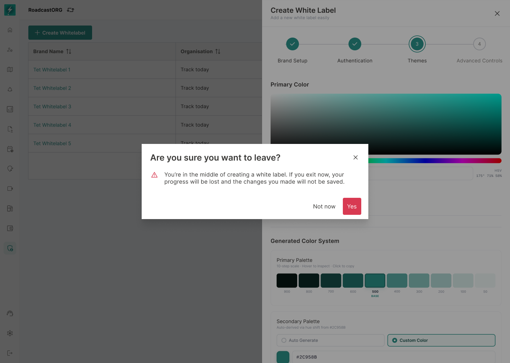
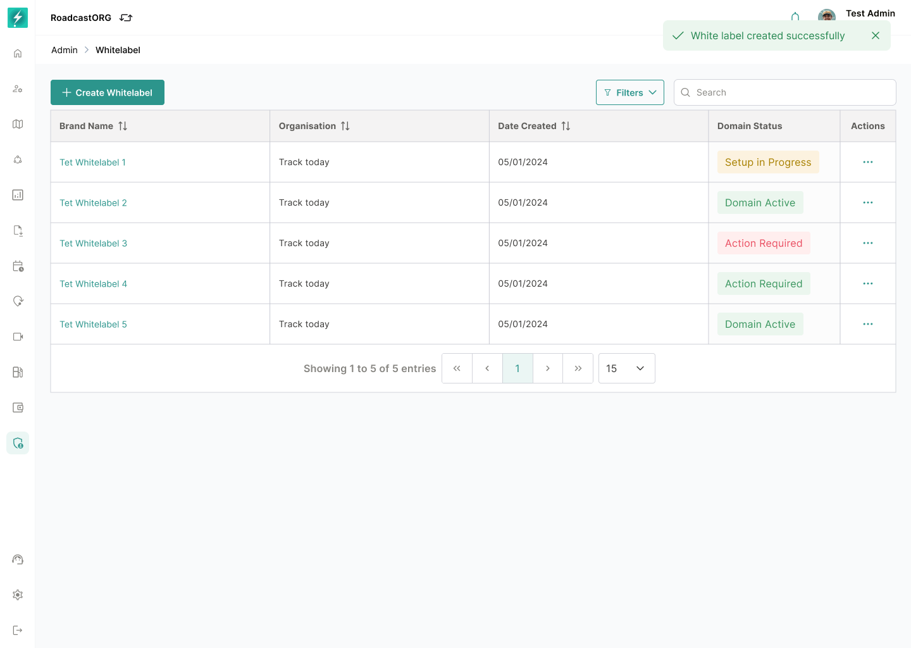

## 11. Create Whitelabel Flow

The approved interface uses a four-step create flow:

| Step | Name | Purpose |
| --- | --- | --- |
| 1 | Brand Setup | Configure brand identity, organisation mapping, legal links and app access links. |
| 2 | Authentication | Configure login method and default authentication experience. |
| 3 | Themes | Configure primary colour and generated UI colour roles. |
| 4 | Advanced Controls | Configure domain and advanced settings. |

### 11.1 Step Navigation

- User should move sequentially through the setup steps.
- `Save & Continue` saves the current step and moves to the next step.
- `Cancel` during creation should show a confirmation warning if unsaved changes exist.
- The creation flow includes a cancellation warning: progress will be lost if the user exits mid-creation.
- The system should autosave only if explicitly designed; otherwise saved state depends on `Save & Continue`.

*Closing an in-progress wizard requires explicit confirmation when entered data would be lost.*

### 11.2 Minimum Creation Requirement

A whitelabel should not be publishable until required fields are complete and validation passes.

Suggested minimum fields:

- Brand Name.
- Organisation.
- Brand Logo.
- Favicon.
- At least one authentication method.
- Primary colour.
- Legal URLs if customer-facing deployment requires them.
- Domain if custom domain is part of purchased package.

---

### 11.3 Successful Completion

After the final step is saved successfully:

- Close the wizard.
- Return the user to the Whitelabel Manager list.
- Show a success confirmation.
- Display the newly created record using the latest saved values.
- Keep the record unpublished if the implementation separates save from publish.

*Successful creation returns the user to a refreshed management list with a clear confirmation message.*

---
