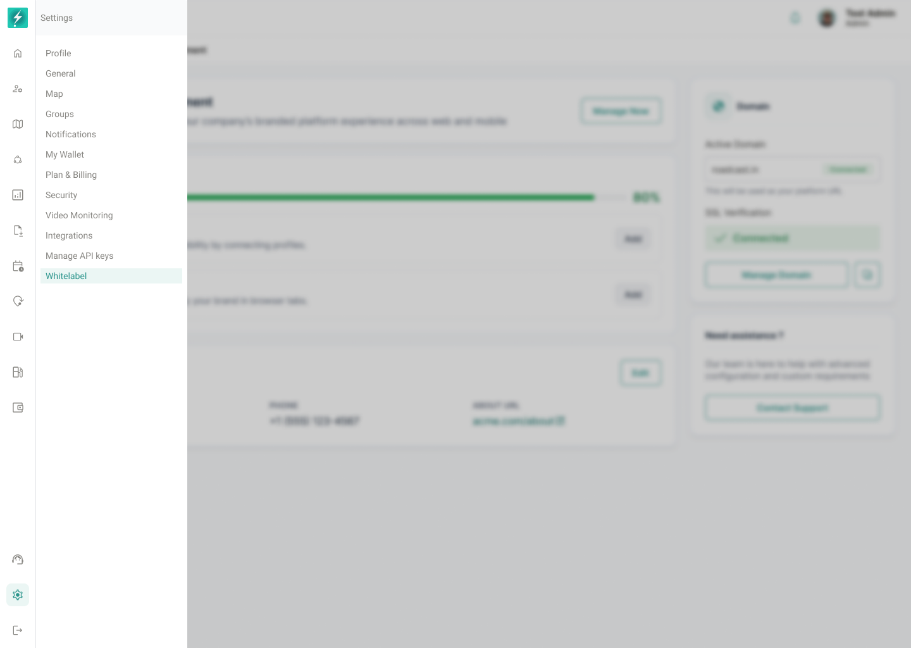

## 7. Information Architecture

### 7.1 Client-side IA

Recommended final IA:

```text
Settings
└── Branding / White Label
    ├── Locked Preview
    ├── Purchase / Unlock Branding
    ├── Brand Setup
    ├── Login & Experience
    ├── Themes
    ├── Domains
    ├── App Distribution / App Build Status
    ├── Preview
    └── Publish / History
```



*Whitelabel is available from Settings. Navigation visibility and page access must follow entitlement and RBAC.*

### 7.2 Admin-side IA

Approved Admin interface:

```text
Admin
└── Whitelabel Manager
    ├── Whitelabel List
    ├── Create Whitelabel
    │   ├── Brand Setup
    │   ├── Authentication
    │   ├── Themes
    │   └── Advanced Controls
    ├── View Whitelabel
    │   ├── Brand Setup
    │   ├── Authentication
    │   ├── Themes
    │   └── Advanced Controls
    └── Edit Whitelabel
        ├── Brand Setup
        ├── Login & Experience
        ├── Themes
        └── Advanced Controls
```

---
