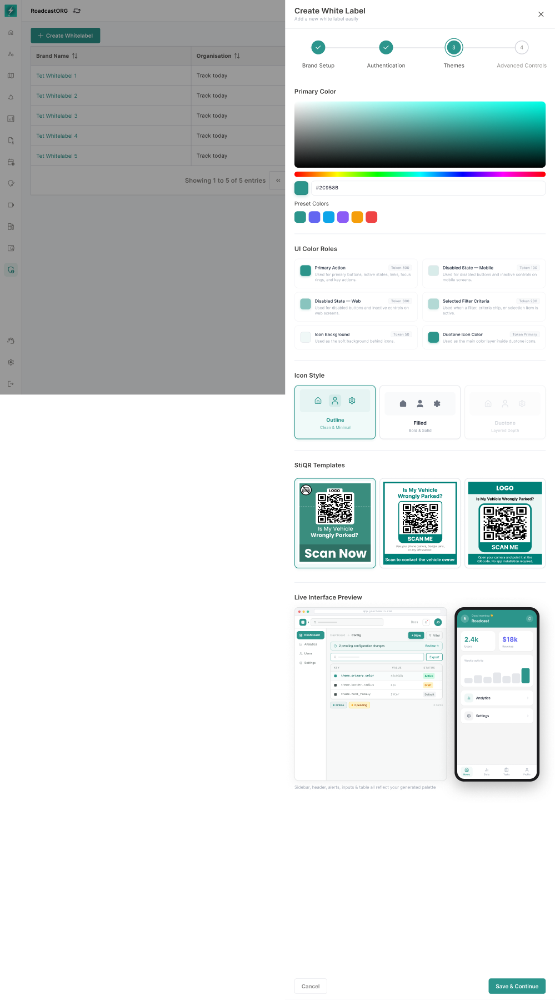
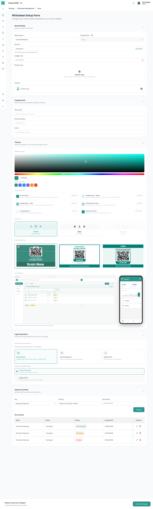

## 17. Mobile Branding: Runtime Theme Sync and Build Tracking

Mobile branding has two separate scopes: runtime mobile theme reflection and full branded mobile app build tracking. Runtime theme reflection applies supported published theme tokens inside the existing Bolt mobile app without a new release. Full app-store white labelling may still require internal developer, QA and release workflow.

### 17.1 Runtime Mobile Theme Sync

The mobile app must consume the active published Branding configuration for the logged-in organisation or company context wherever runtime theming is supported. Supported mobile tokens should be applied to mobile UI elements such as primary actions, disabled controls, icon backgrounds, duotone icon treatments and authenticated brand surfaces.

Runtime mobile theme sync must follow these rules:

- The mobile app fetches the active Branding configuration after login and at defined refresh points.
- The mobile app should cache the last valid branding configuration for resilience.
- Published theme changes should become visible after app refresh, re-login or the next configuration fetch.
- Missing or invalid mobile tokens should fall back to default Bolt mobile tokens.
- Mobile token sync must be versioned so the app can avoid applying stale or partially published configuration.
- Mobile theme sync must never change Play Store / App Store app name, launcher icon, package name, bundle ID or store listing. Those belong to the mobile build workflow.

### 17.2 Mobile Build Flow Summary

The approved operational flow requires:

- Customer purchases branding.
- Customer completes branding setup.
- Android app update shows estimated delivery, often around a 7-day timeline in current process context.
- Client gets tracking for app build.
- Internal team uploads build for a specific organisation.
- Client can approve or disapprove build.
- Disapproval requires comments.
- Older builds should be stored in history to avoid conflicts.
- Live app link is uploaded after release.

*The administrator view supports app-distribution assets and QR-code configuration alongside web and mobile previews.*

*The full management form consolidates brand identity, theme tokens, QR assets, store links, domains, and saved records.*

### 17.3 Mobile Build Statuses

Recommended statuses:

| Status | Meaning |
| --- | --- |
| Not Initiated | Required inputs are incomplete or build has not been requested. |
| Ready to Initiate | All mandatory fields are complete. |
| Initiated | Build request has started; estimated delivery date shown. |
| In Review / Testing | Build is being checked internally. |
| Build Ready | APK or preview build is available. |
| Client Review | Client can approve or reject. |
| Approved | Client accepted build. |
| Rejected | Client rejected build with comments. |
| Published | App live link available. |
| Delivered | App delivery complete. |

### 17.4 Approval Rules

- Client approval should be required before publishing a branded mobile build.
- Rejection must require a comment.
- Rejected builds should trigger internal notification or ticketing.
- Older build versions should remain available in history.
- Further customisation after delivery should be handled as a new support request or charged separately, based on commercial policy.

### 17.5 Mobile White-label Limitation

The product workflow contains two separate delivery directions: full mobile app branding with separate app identity and internal build workflow, and lightweight in-app theme sync from web setup. This guide recommends splitting them:

- **Phase 1:** Web branding + mobile in-app theme sync for runtime-supported tokens.
- **Phase 2:** Branded Android app build tracking.
- **Phase 3:** iOS app build tracking and deeper app-store identity support.

---
