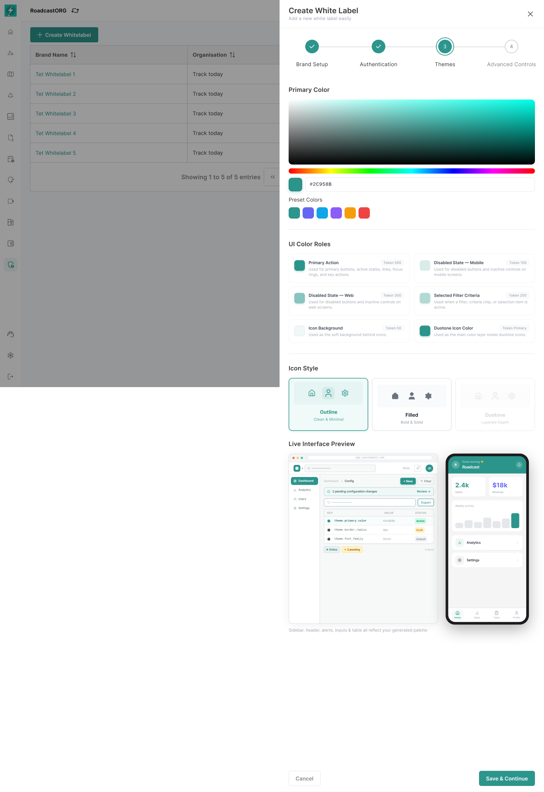

## 14. Themes

Themes define how the brand is visually applied to Bolt.

### 14.1 Approved Theme Fields

The approved theme interface includes:

- Primary Color.
- Preset Colors.
- Generated Color System.
- Primary Palette.
- Custom Color.
- UI Color Roles.
- Primary Action.
- Disabled State Web.
- Disabled State Mobile.
- Icon Background.
- Duotone Icon Color.
- Token references such as `theme.primary_color`, `theme.border_radius` and `theme.font_family`.

*Theme configuration combines the primary colour, generated palette, UI roles, token values, and web/mobile previews.*

### 14.2 Requirements

- User can select a primary brand colour using presets or custom colour entry.
- System generates supporting colour roles from primary colour.
- User can preview generated UI roles before saving.
- User can edit theme in create and edit flows.
- Theme must apply consistently across web and inside the Bolt mobile app wherever runtime mobile theming is supported.
- Theme should not reduce accessibility below approved contrast thresholds.

### 14.3 Colour Role Rules

| Role | Usage |
| --- | --- |
| Primary Action | Primary buttons, active states, links, focus rings and key actions. |
| Disabled State Web | Disabled controls in web screens. |
| Disabled State Mobile | Disabled controls in mobile screens. |
| Icon Background | Soft background behind icons. |
| Duotone Icon Color | Main colour layer in duotone icons. |

### 14.4 Logo Colour Auto-detection

The operational workflow recommends colour auto-fetch from logo. This should be treated as a recommended enhancement.

Initial release can support manual primary colour selection. Phase 2 can support extracting suggested colours from uploaded logo.

### 14.5 Mobile Theme Reflection

The branding theme configured in the web Branding Module must also reflect inside the Bolt mobile app wherever runtime theming is supported. This requirement applies to the authenticated mobile experience and should not be confused with full app-store white labelling.

The following theme values should sync from web to mobile in Phase 1, subject to mobile design-system support:

- Primary colour.
- Disabled state mobile colour.
- Icon background colour.
- Duotone icon colour.
- Brand logo where supported in the authenticated mobile experience.
- App display branding inside mobile surfaces that support remote branding.

Mobile theme changes should not require a new app build if they only affect runtime-supported theme tokens. These changes should sync after publish and should become visible after app refresh, re-login or the next theme-configuration fetch.

Changes that affect Play Store / App Store identity must continue to follow the mobile build workflow. This includes app name, launcher icon, package name, bundle ID, store listing, app-store screenshots and bundled splash assets.

If mobile theme sync fails, the mobile app must fall back to the default Bolt theme and log the sync failure for support/admin visibility.

---
