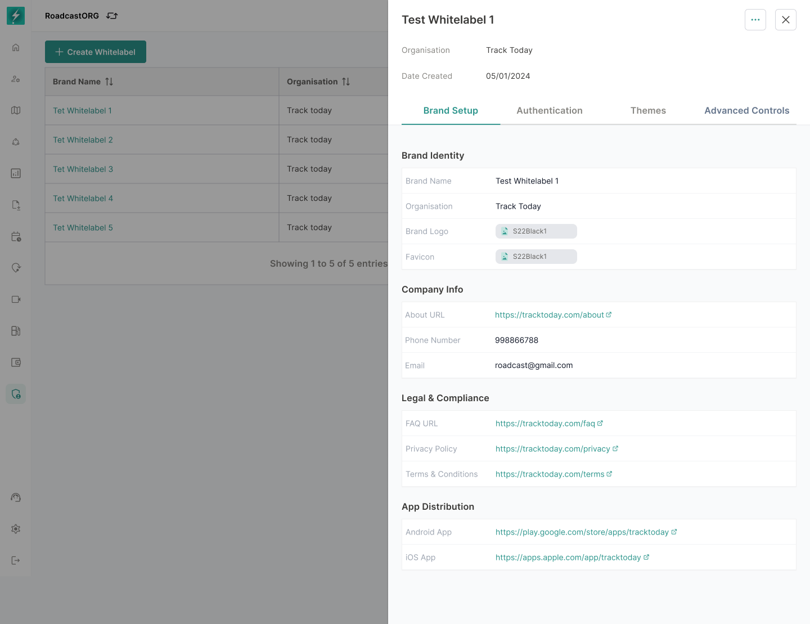
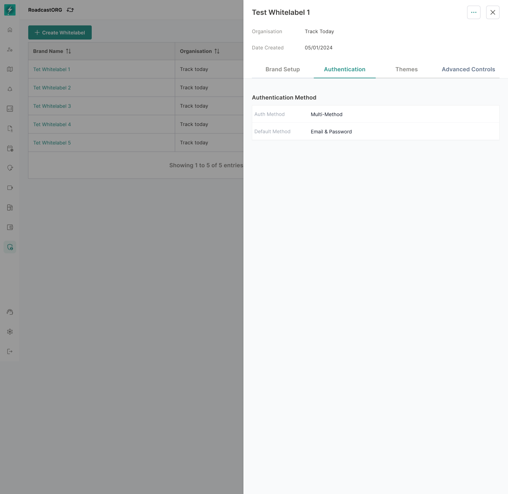
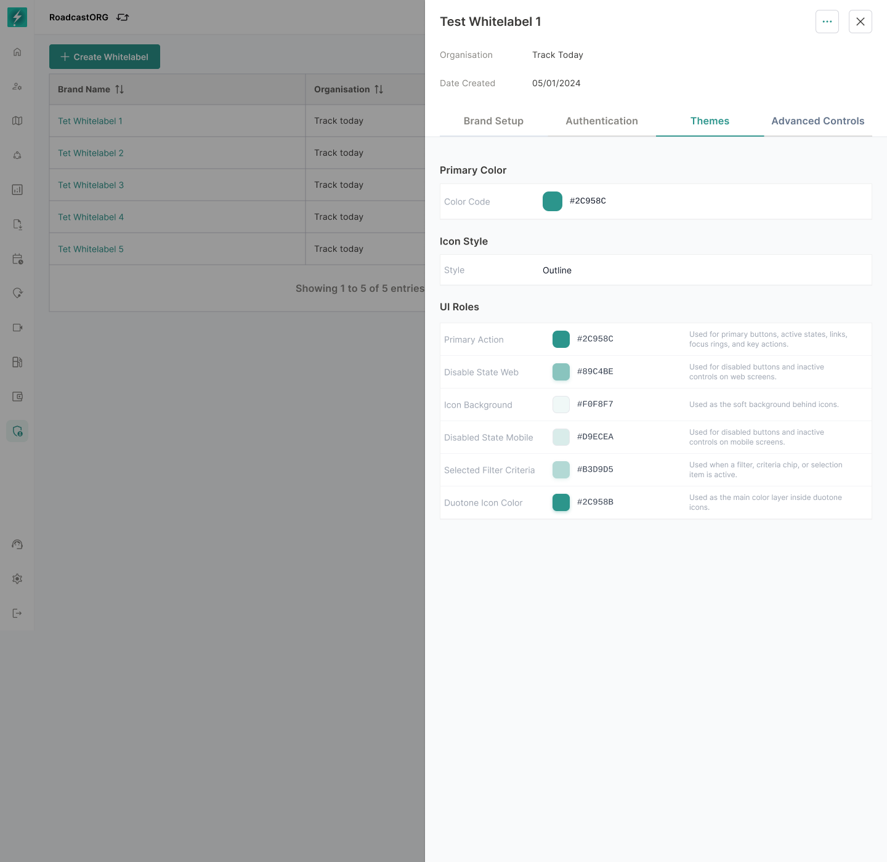
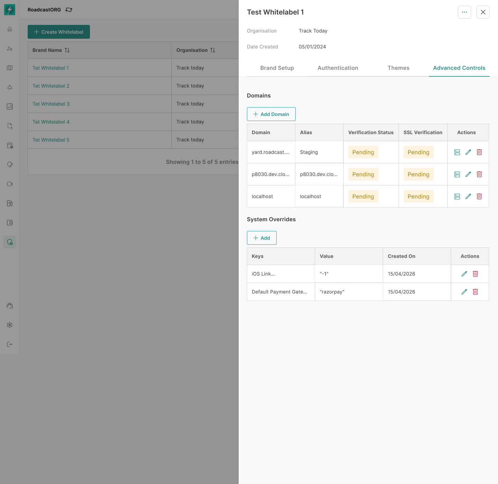
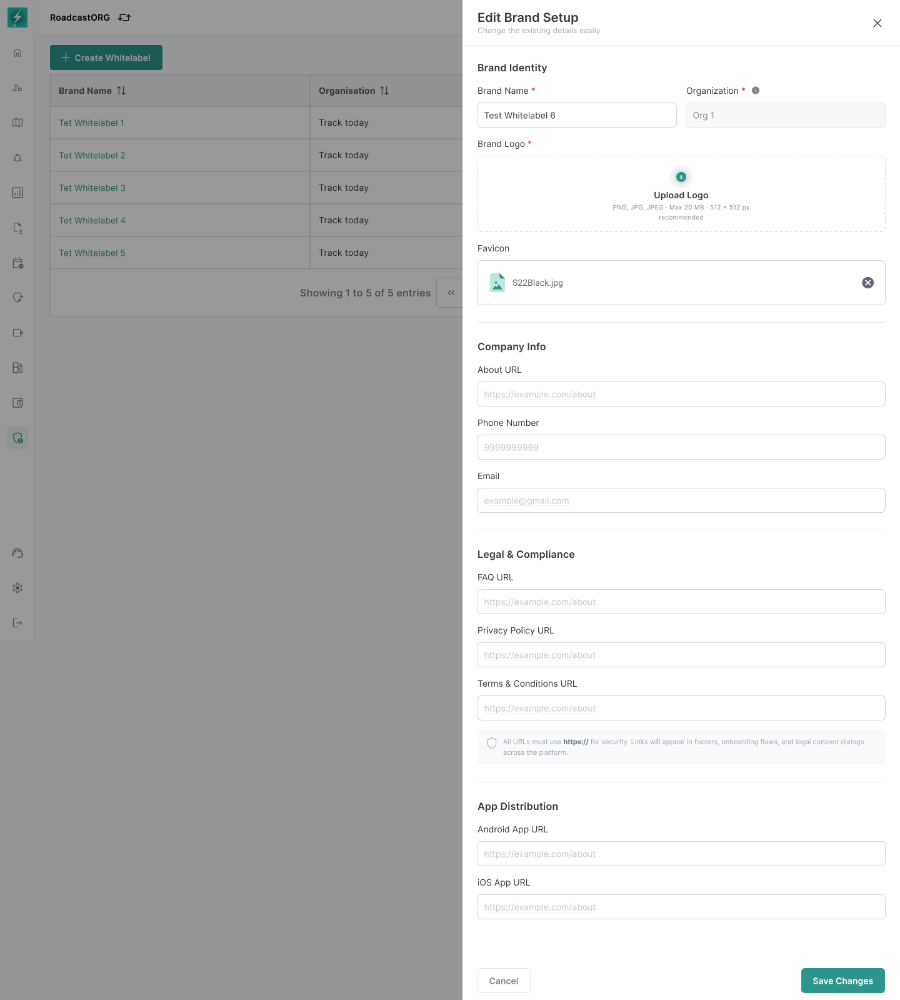
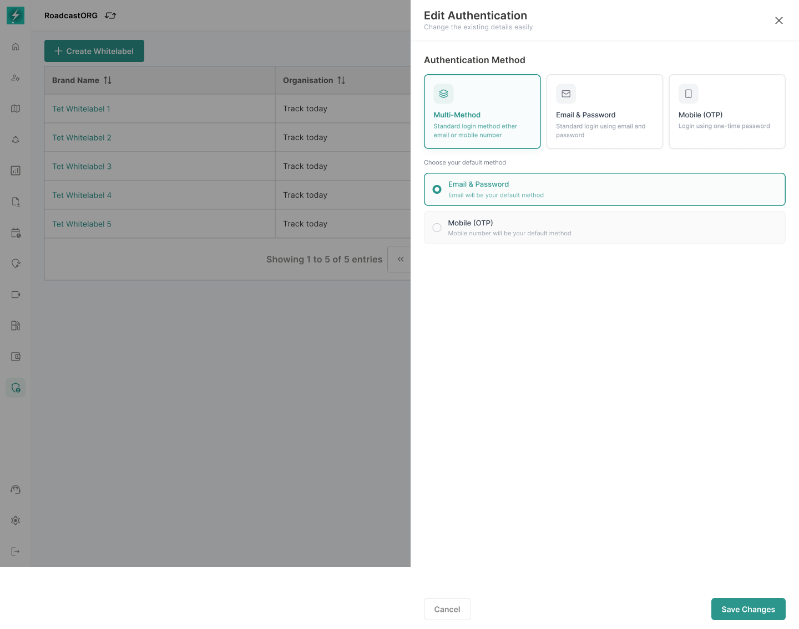
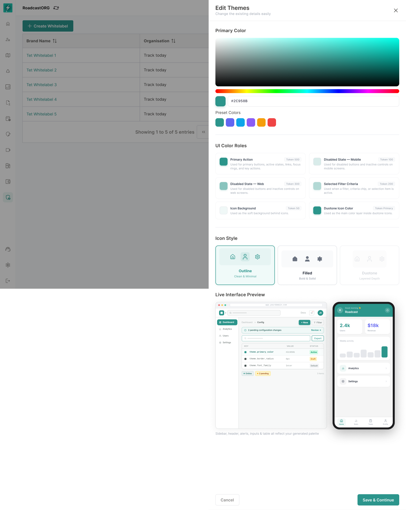
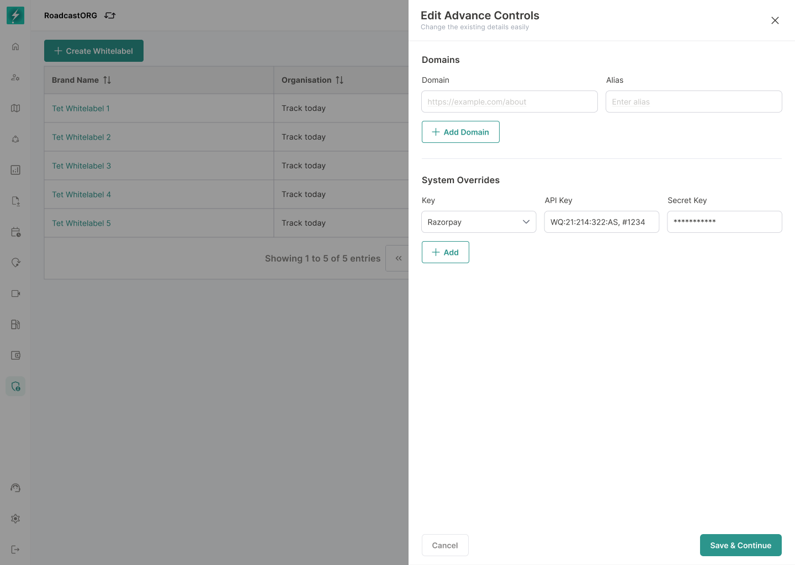

## 18. View and Edit Whitelabel

### 18.1 View Mode

View mode should show the saved/published configuration in read-only format.

Approved read-only sections:

- Brand Setup.
- Authentication.
- Themes.
- Advanced Controls.
- Child Users.
- License Number.
- Organisation.
- Brand identity.
- App links.

*Brand Setup presents saved identity, contact, legal, and app-distribution values in read-only form.*

*Login and Experience shows enabled authentication methods and the selected default.*

*Themes exposes saved colour roles, token values, and preview information without allowing accidental edits.*

*Advanced Controls shows domain and system-owner records while masking sensitive values.*

### 18.2 Edit Mode

Edit mode allows authorised users to change:

- Brand Setup.
- Login & Experience.
- Themes.
- Advanced Controls.

*Brand Setup editing reuses the approved field groups and inline validation from creation.*

*Authentication editing preserves at least one enabled method and one valid default.*

*Theme editing exposes generated roles and previews before changes are saved or published.*

*Advanced Controls editing limits domain and system-owner changes to users with explicit permission.*

### 18.3 Edit Rules

- Editing a published configuration creates a draft version unless the system is explicitly immediate-save.
- User must save changes before leaving a step.
- Publishing should create a versioned record.
- Critical fields such as domain and app links may require additional validation or internal approval.

---
