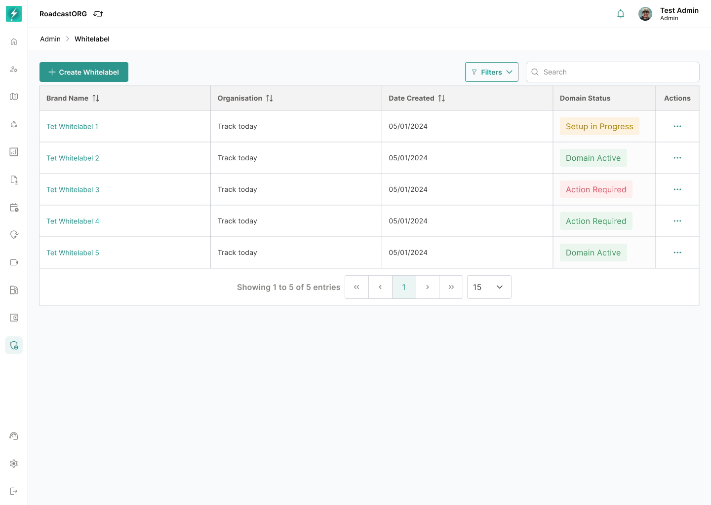
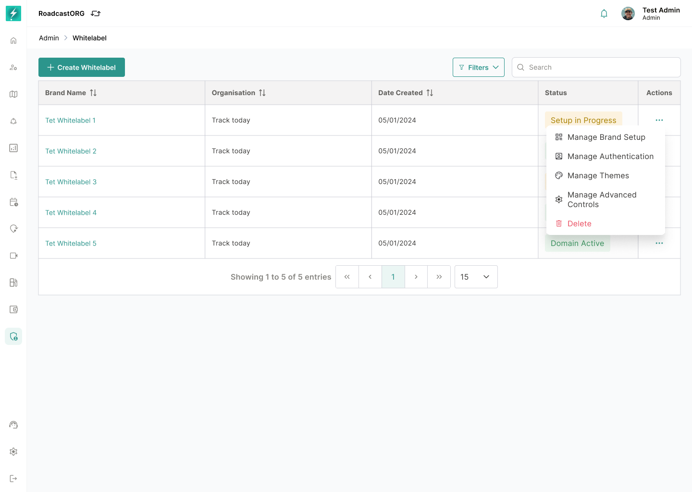

## 10. Whitelabel List

The Whitelabel Manager list is the central table for all configured brands.

*The list provides organisation-level status, created date, search, filters, pagination, and record actions.*

### 10.1 Table Columns

Approved columns:

| Column | Description |
| --- | --- |
| Brand Name | Whitelabel display name. |
| Organisation | Organisation mapped to the whitelabel. |
| Date Created | Creation date of the whitelabel record. |
| Actions | View, edit, delete or manage options depending on permission. |

### 10.2 List Actions

- Create Whitelabel.
- Search.
- Filters.
- Pagination.
- Row action menu.
- View whitelabel detail.
- Edit whitelabel configuration.
- Delete/deactivate whitelabel if allowed.

*The row menu exposes only the actions permitted for the selected record and current user.*

### 10.3 Rules

- One organisation should not have conflicting active whitelabel records unless multi-brand support is explicitly enabled.
- Brand name should be unique within the managing tenant or organisation scope.
- Deleting a published whitelabel must require confirmation and should not break active users without fallback.

---
