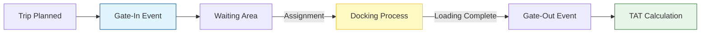

# Yard & Warehouse Management

The Yard Management System (YMS) in Bolt V2 is the central command center for all facility operations. It digitizes the flow of vehicles, drivers, and materials in and out of your warehouse, providing real-time visibility into dock utilization and operational efficiency.

This module is designed to answer critical questions:

* _Which vehicles are currently inside the premises?_
* _Which docks are occupied?_
* _Are we meeting our Turn-Around Time (TAT) targets?_

#### 1. The Yard Overview Dashboard

Upon entering the **Yard Module**, you are greeted with the **Overview Dashboard**. This screen provides a high-level snapshot of your facility's health.

**1.1 Key Metrics**

The dashboard cards at the top display real-time counts:

* **In-Premise:** Total number of vehicles currently inside the geofenced yard.
* **At Dock:** Vehicles actively loading or unloading.
* **Waiting:** Vehicles that have "Gated-In" but have not yet been assigned a dock.
* **Completed:** Trips finished today.

**1.2 The Trip Timeline**

Below the metrics, the **Trip Timeline** visualizes the flow of traffic over the last 24 hours. Spikes in the graph indicate peak operational hours, helping you plan labor shifts effectively.

<figure><figcaption></figcaption></figure>

#### 2. Monitoring Dock Operations

The **Dock View** is a digital twin of your physical loading bays. It replaces manual whiteboards with a live, color-coded interface.

**2.1 Dock Status Legend**

Each dock is represented by a card that changes color based on its status:

* **Green (Available):** The dock is empty and ready for assignment.
* **Red (Occupied):** A vehicle is currently docked. The card displays the Vehicle ID and the "Time at Dock" timer.
* **Grey (Disabled):** The dock is under maintenance or closed.

**2.2 Drag-and-Drop Assignment**

Dispatchers can assign a waiting vehicle to a dock simply by dragging the vehicle card from the "Waiting List" and dropping it onto an "Available Dock." This action automatically updates the driver's mobile app with the new instruction.

> \[!SCREENSHOT\_MARKER] **Source:** `TRIP_HUB_SOLUTION.pdf` (Page 2 / "HaltPoints" Diagram) **Description:** While this diagram explains routing, use the screenshot from your system that shows the **Dock Grid** view (likely found in `src/app/portal/yard/dockOperations`). It should show multiple dock cards with at least one "Red/Occupied" status to demonstrate activity.

#### 3. TripHub: Managing the "Day of Operation"

The **TripHub** is the execution engine for daily logistics. Unlike static route planners, the TripHub allows you to manage the chaos of real-world operations—such as delayed arrivals, broken-down vehicles, or emergency load requests.

**3.1 The Trip List**

The main table lists every active trip. Critical columns include:

* **Trip ID:** Unique identifier for audit trails.
* **Status:** Current state (Scheduled, In-Transit, At-Dock, Completed).
* **TAT Gauge:** A visual progress bar showing if the trip is "On Time" (Green) or "Delayed" (Red).

**3.2 Handling Exceptions**

If a vehicle is delayed or a dock is blocked, supervisors can manually intervene directly from this list:

1. **Click:** Select the Trip ID to open the detailed view.
2. **Action:** Use the "Reassign Dock" or "Force Complete" buttons to resolve the bottleneck.
3. **Log:** The system prompts for a "Reason Code" to ensure the delay is categorized for future reporting.

> \[!SCREENSHOT\_MARKER] **Source:** `TripHub_Waste_Management_Technical_Proposal.docx` (Page 3 / "Core Operational Entities") **Description:** Insert the screenshot showing the **Trip List** table. Ensure the "Status" badges and the "Action Kebab Menu" (three dots) are visible, illustrating where users click to manage trips.

#### 4. Driver & Vehicle Assignment

Before a trip can begin, a driver and vehicle must be securely linked.

* **Manual Linking:** Dispatchers select a "Pending" trip and use the search bar to assign an available driver and vehicle from the Master List.
* **QR Scanning (Guard View):** For faster processing, security guards at the gate can scan a driver's QR code using the **Guard Mobile View**. This instantly links the driver to the vehicle and marks the trip as "Gated-In."



<figure><figcaption></figcaption></figure>



<figure><figcaption></figcaption></figure>



<figure><figcaption></figcaption></figure>



#### 5. Logical Architecture: From Planning to Gate-Out

Understanding the flow of a "Yard Trip" helps in troubleshooting and optimization.

1. **Gate-In:** The "Clock Starts" when the vehicle crosses the perimeter geofence.
2. **Processing:** Time spent at the dock is measured against the "Standard Loading Time" for that material type.
3. **Gate-Out:** The "Clock Stops" when the vehicle leaves. The total duration is your **Turn-Around Time (TAT)**.

#### 6. Troubleshooting Common Yard Issues

**Q: A vehicle is at the dock, but the system shows it as "Waiting."** **A:** The driver or guard may have missed the "Dock-In" scan. Use the **TripHub** list to manually update the status to "At Dock."

**Q: Why is my Dock Utilization 0%?** **A:** Ensure your **Geofences** are correctly drawn around the warehouse perimeter. Without a valid geofence event, the system cannot trigger the "In-Premise" logic.
