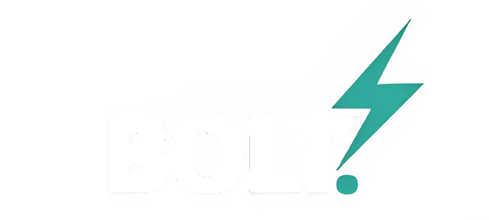

# Home

##

<figure><figcaption></figcaption></figure>

## Welcome to the BOLT V2 docs

You’re in the right place if you run fleets, field assets, or on‑ground teams.

This space helps you go from “what is BOLT?” to “ship it in production”.


These docs are written for operators and product owners first.

If you’re integrating systems, start with the overview.


### Pick your path

* **I’m new here** → get the big picture, then learn the core concepts.
* **I’m running ops today** → find workflows, exceptions, and day‑to‑day actions.
* **I’m a product owner** → focus on roles, configuration, and KPI alignment.

### How to use this documentation

#### Start with the overview

Begin with the **Executive Overview** page to understand why BOLT V2 exists, who it serves, and the value it delivers.

Use this section to align stakeholders on the mission, scope, and personas before diving into workflows.

If you’re on-boarding a new team, make this page part of your first-day briefing.

#### Follow the workflows

Then follow the embedded screenshots or short clips to execute with confidence.

Skim the persona callouts (“Product Owner”, “Ops Lead”, “Consumer”) so you know which steps apply to you.

Each workflow page lays out: when to use it, prerequisites, step-by-step actions, and KPIs to watch.

Move into the **Feature Guides** and **Journeys** collections.

#### Follow the workflows

The list doubles as a checklist when you configure the platform.

### Your first 15 minutes



### Login and account setup

Navigate to your dedicated URL provided by your administrator.

Enter your credentials.

If MFA is enabled, use the OTP you receive.

If you belong to multiple organizations, select the relevant workspace.



### Confirm visibility

Open the map.

Find one asset (search by name, ID, or plate).

Open its details card.

Confirm status and last update time.



### Set one signal you’ll monitor

Pick 1 KPI or alert you care about this week.

Examples: idling, speeding, geofence entry/exit, ignition on/off.

Set it up and test it once.


